+++
title = 'Active Directory/Splunk project PART 1'
date = 2024-06-30T07:07:07+01:00
+++

**Objectives:**

Setting up Splunk server to analyze events

Learning the basics of Active Directory

Attacking the AD to see what kind of telemetry it produces

**Project setup overview:**

· Active Directory Server (with Splunk Universal Forwarder and Sysmon installed)

· Windows workstation (with Splunk Universal Forwarder and Sysmon installed)

· Splunk Server

· Kali Linux machine for attacking the AD

· All the machines are in the same NAT network so that they can have internet access and can communicate with each other

To accomplish this I followed tutorials and documentations

**Setting up the environment in VirtualBox**

1. Configuring Splunk Server

First I edited the 00-installer-config.yaml file — the only file in /etc/netplan directory

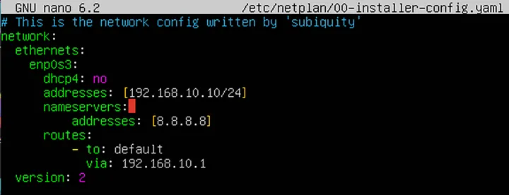

I disabled dhcp and assigned a static IP address of 192.168.10.10 as my AD network is 192.168.10.0/24. Then I set up a DNS server to google’s server 8.8.8.8 and route to default via the gateway in the AD network. I applied the changes with the command

> sudo netplan apply

To install splunk I copied the installation file to the machine and run the command

> sudo dpkg -i <splunk.deb file>

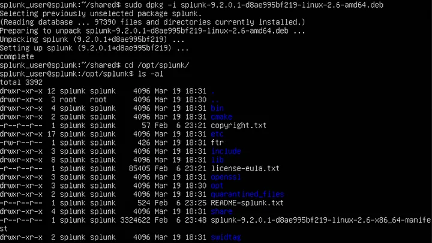

As the files are owned by user 'splunk' I changed into it and from the bin directory ran ./splunk start

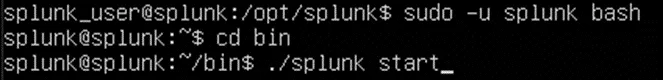

To ensure that splunk starts on boot (as user ‘splunk’) I ran the command

> sudo ./splunk enable boot-start -user splunk

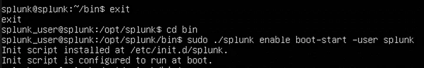

2. Installing Splunk Universal Forwarder and Sysmon on both Windows machines (the domain controller and workstation)

First I downloaded the universal forwarder from the splunk website directly on my server and ran the installer. I left the 'Deployment Server' empty and put the IP of my splunk server as 'Receiving Indexer'

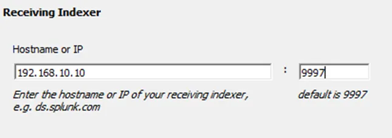

Next up I installed sysmon with config from https://github.com/olafhartong/sysmon-modular

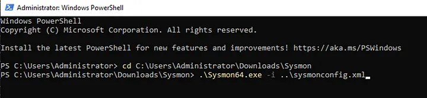

Then I addded inputs.conf to SplunkUniversalForwarder\etc\system\local to specify what kind of data will be send over to the server

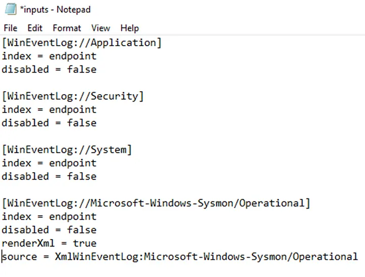

I changed the 'log on as' option of the SplunkForwarder service to avoid problems with permissions

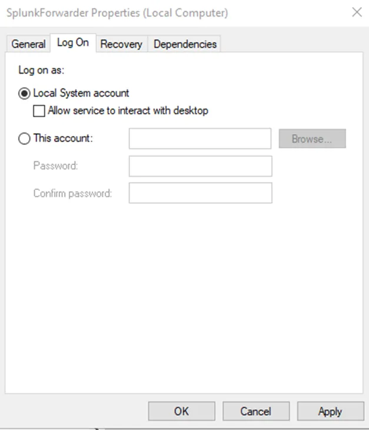

After that I accessed my splunk server on port 8000 and went to 'Settings -> Indexes' to create the index declared in my inputs.conf file (endpoint)

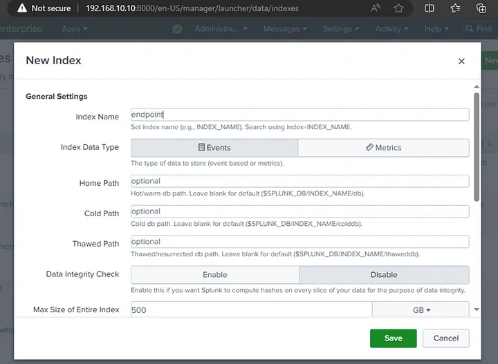

Then in 'Settings -> Forwarding and receiving -> Configure receiving' I added new receiving port — the one declared during installation — 9997

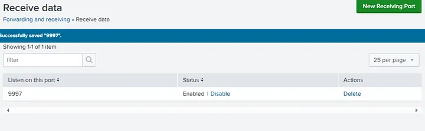

To verify if I set it up correctly I searched index="endpoint" and got some events with the host of DC-01 which is the name of my Windows server

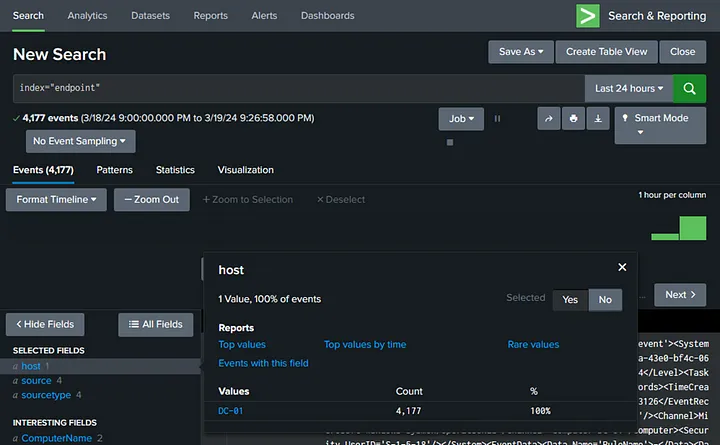

I repeated the same process on the Workstation machine and at the end verified whether I received data from both hosts

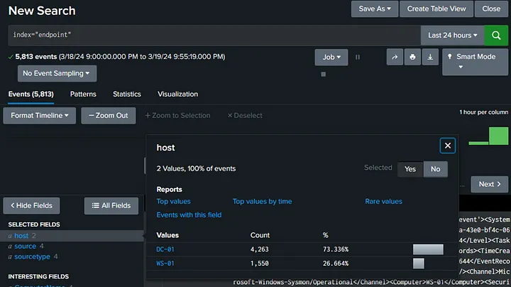