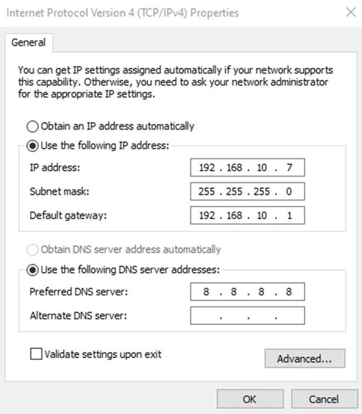
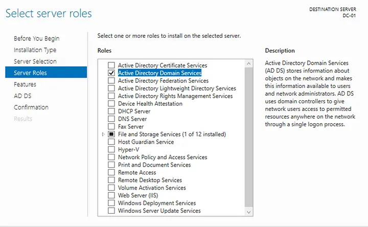
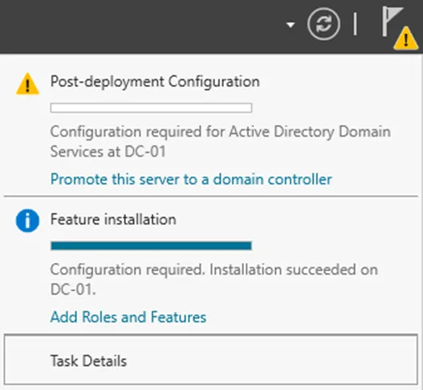
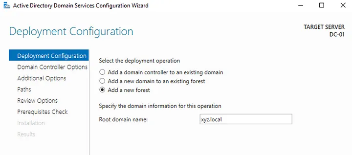
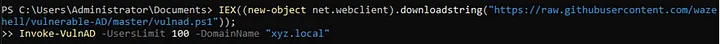
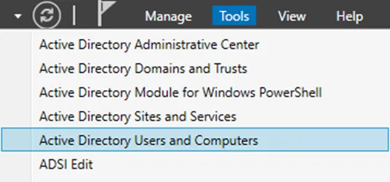
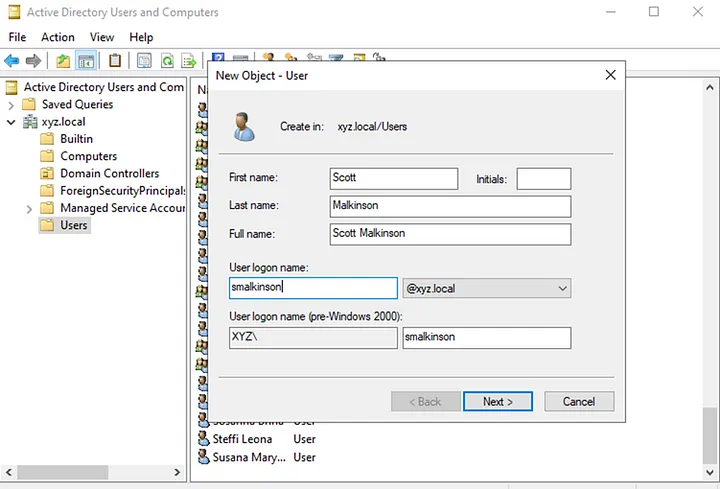
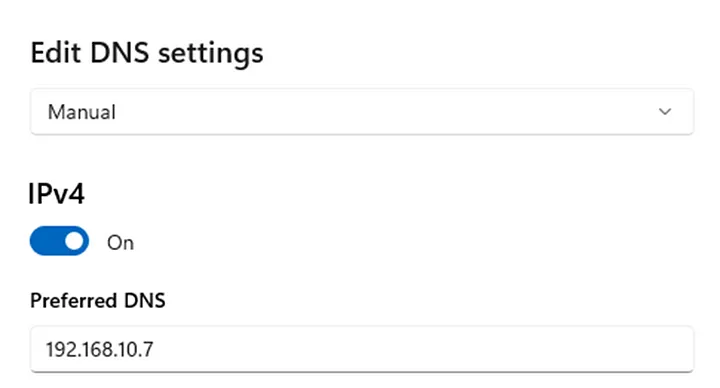
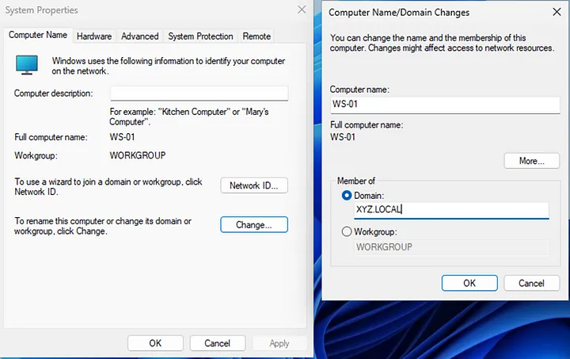

+++
title = 'Active Directory/Splunk project PART 2'
date = 2024-07-10T07:07:07+01:00
+++

**Configuring Active Directory**

First I assigned a static IP to my Windows server

Then in the Server Manager I added 'Roles and Features' in the 'Manage' section. During the installation I selected Role-based installation with Active Directory Domain Services role

After successful installation I promoted the server to domain controller and created new domain XYZ

After all was configured it was time to populate the AD with some objects (users, groups etc). It can be done using GUI or with powershell. I opted for the latter option using the script from https://github.com/safebuffer/vulnerable-AD/tree/master to create a vulnerable AD so I could attack it later

At the end I created one more user for my workstation machine

The last step was configuring Windows workstation. First I changed the DNS server to my domain controller so that the machine could resolve the domain xyz.local

Then I added the workstation to the domain

After restarting I successfully signed in to my XYZ domain as 'smalkinson'

