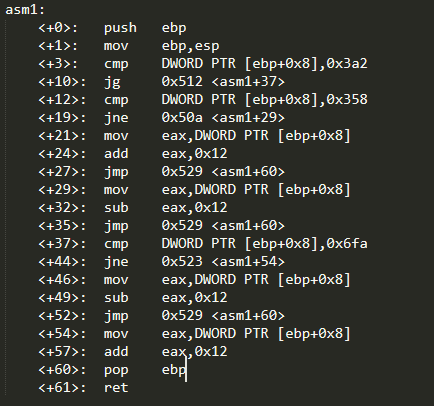
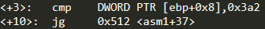
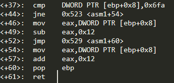
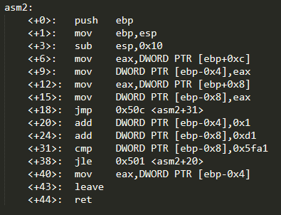
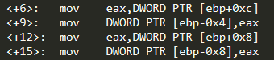
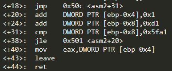
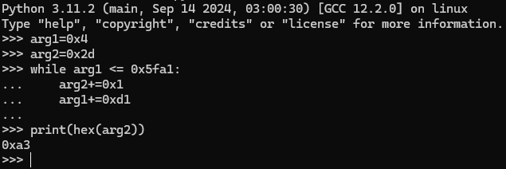

+++
title = 'PicoCTF asm1 and asm2 write-up'
date = 2024-12-05T07:07:07+01:00
+++
**Description**

*What does asm1(0x6fa) return? Submit the flag as a hexadecimal value (starting with '0x'). NOTE: Your submission for this question will NOT be in the normal flag format.*

Let's follow the execution flow for 0x6fa in the provided assembly code

First 2 instructions are the standard function prologue, then the argument passed to the function, which is at [ebp+0x8], is compared to 0x3a2

'jg' means jump if greater. Since we are checking for argument=0x6fa this condition is true and the jump to provided address (line <+37> in our code) is triggered

We start with another comparison between our argument and 0x6fa and then we jump if the values are not equal. In our case they are equal so we move on to the next instructions. We move our argument to eax, we substract 0x12 from it and jump to <+60> which is the end of the function. So the result is 0x6fa - 0x12 = 0x6e8

**ASM2 Challenge**

**Description**

*What does asm2(0x4,0x2d) return? Submit the flag as a hexadecimal value (starting with '0x'). NOTE: Your submission for this question will NOT be in the normal flag format.*

Like in the first challenge we are provided with assembly code

Again, first two instructions are the function prologue, then we substract from esp (stack pointer), securing this space on the stack for our local variables. We substract because the stack grows downwards meaning it starts at the highest address and goes lower and lower

With these 4 mov instructions we put our arguments on the stack. Firstly we move the second argument ([ebp+0xc]) to eax and then we put it on the stack at [ebp-0x4]. Its the same thing with the first argument which ends up at [ebp-0x8]

After that we jump to <+31> and we compare our first argument to 0x5fa1. Since its lower than the constant value, the jump if less or equal gets executed and we go to <+20> line where we add 0x1 to the second argument  and then 0xd1 to the first one. We compare values again, creating a loop that will end whenever the value at [ebp-0x4] surpasses 0x5fa1. Then the value from [ebp-0x4] is moved to eax and is returned by the function. Now that we've understood the code we can write it in python and calculate the returned value

