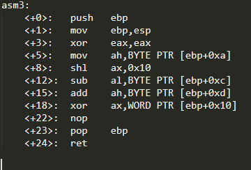
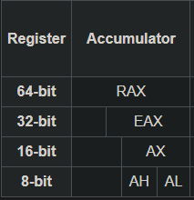
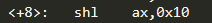
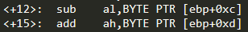
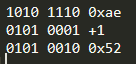
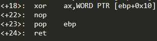
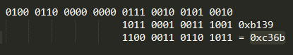

+++
title = 'PicoCTF asm3 write-up'
date = 2024-12-12T07:07:07+01:00
+++
**Description**

*What does asm3(0xd73346ed,0xd48672ae,0xd3c8b139) return? Submit the flag as a hexadecimal value (starting with '0x'). NOTE: Your submission for this question will NOT be in the normal flag format.*

Let's look at the assembly code provided

First the eax is set to 0 with the xor instruction, then we move the byte at [ebp+0xa] (10 bytes from ebp) to ah, which is an 8 bit register within rax as shown below

The arguments passed to the function are at: 1st [ebp+0x8] -  0xd73346ed, 2nd [ebp+0xc] - 0xd48672ae and 3rd [ebp+0x10] - 0xd3c8b139. Remembering that the bytes are stored in reversed order, the byte at [ebp+0xa] is 0x46. So after the mov instruction ah would be `0100 0110 0000 0000` in binary

After that we shift left by 0x10 (16 bytes). The ah (now eax) becomes: `0100 0110 0000 0000 0000 0000 0000 0000`

Then we subtract the [ebp+0xc] (12th byte) from al. Since al is 0 the equation is 0x00 - 0xae. The result is -0xae however we need to convert it to positive number because we are not working on signed integers. To do that, we flip the bits and add 1

The eax is: `0100 0110 0000 0000 0000 0000 0101 0010`. Now the addition of [ebp+0xd] (13th byte) to ah. Ah is 0 so we just put the 0x72 into ah. Eax: `0100 0110 0000 0000 0111 0010 0101 0010`

Last meaningful instruction is the xor operation on ax and WORD (2 bytes) starting at [ebp+0x10]. These 2 bytes are 0xb139 (last two of the third argument - but first two in memory). It's important to remember that xoring the ax will zero out the upper bits of the register

The result is 0xc36b
