+++
title = 'HackTheBox EncryptionBot write-up'
date = 2024-10-30T07:07:07+01:00
+++

**CHALLENGE DESCRIPTION**

*My friend send me a encrypted message by using encryption bot. This is a important message. Can you decrypt the message for me?*

There is encrypted flag and elf file provided

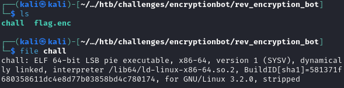

Running the program to see what it does

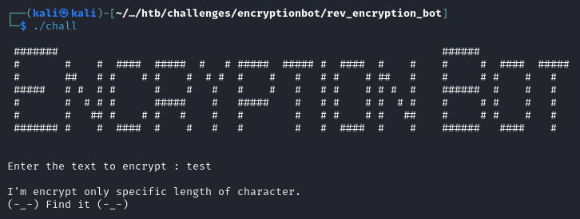

Let's open up ghidra and try to reverse engineer this. First step is to identify the main function. Checking the 'entry' function that runs at the start we can find what function is loaded before calling libc_start_main. Thats our main function

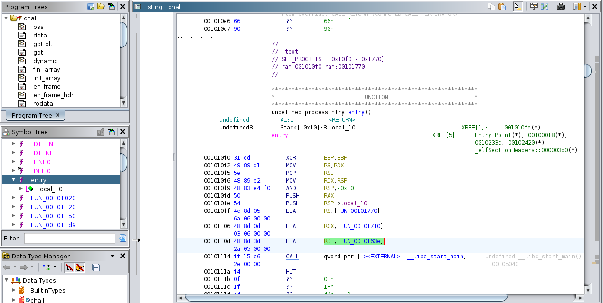

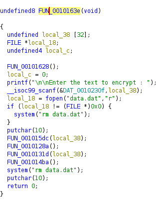

We can see the 'Enter the text to encrypt' string which means its in fact a main function that runs at the start. After receiving input from the user, program checks if file 'data.dat' exists and deletes it if it does. Then 4 functions are called. Function FUN_0010128a does nothing, so let's analyze the other 3.

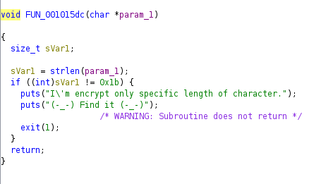

The first function checks the length of the input whether its 0x1b which is 27

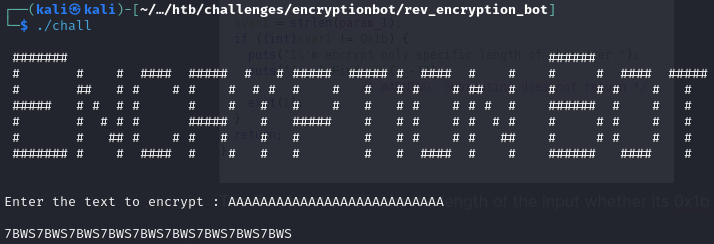

Yep it works for length 27. Let's see the other function that takes the user input as argument

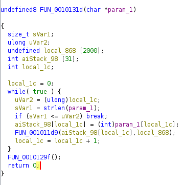

In this function there is a loop that iterates through each character of the user input and passes it to the FUN_001011d9 function

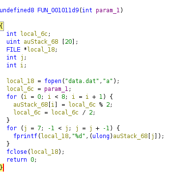

Function FUN_001011d9 converts the ASCII character to an 8 bit binary representation and then writes it to 'data.dat' file in the reverse order. Now we've followed that flow we can go back to FUN_001014ba which is the last function called in main

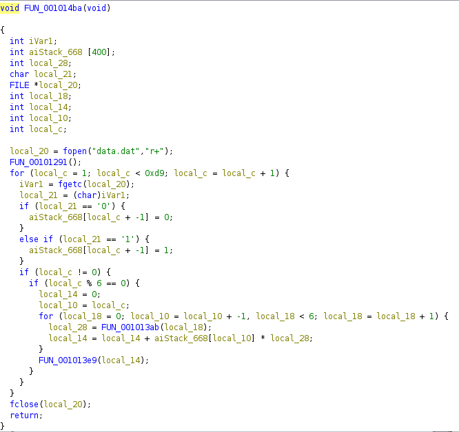

We see that the 'data.dat' file is opened, a FUN_00101291 is called which does nothing and then there is a for loop that iterates as long as the local_c is less than 0xd9, which is 217 in decimal. So there is 216 iterations. Why 216? Because our input has length of 27 and each character got converted to an 8 bit binary which means that there is 27 * 8=216 bits. Inside the for loop the first two if statements check the value of character read from file. If the value is '0' then 0 is added to an array, if it's '1' then 1 is added

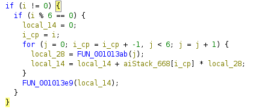

This next bit of code executes every 6 bits and it contains a for loop that iterates 6 times and does 2 things:
 - stores the result of FUN_001013ab function in local_28
 - keeps track of sum of a bit at index 'i' (which goes from highest to lowest) multiplied by local_28

Let's see what does the FUN_001013ab return

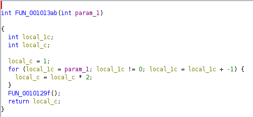

There is a for loop that iterates 'param_1' times and it multiplies local_c by 2 - which default value is 1. FUN_0010129f() does nothing. Essentially the returned value is 2^param

Let's go back to the caller function 

As previosly mentioned local_14 stores the sum of a bit at index 'i' multiplied by local_28 (2^j). So it essentially converts a 6 bit binary to decimal. After the loop there is a last call to another function called FUN_001013e9 with local_14 as an argument

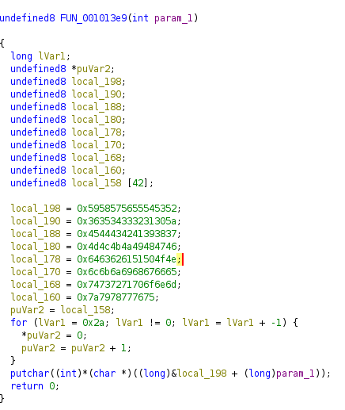

Here we see a bunch of variables storing hex values. After converting them to ASCII we get a `YXWVUTSR6543210ZEDCBA987MLKJIHGFdcbaQPONlkjihgfetsrqponmzyxwvu`. However since this is a x86 program it uses little endian system to store bytes in memory, which essentially means that each value is stored in reversed order. So in memory it would look like this: `RSTUVWXYZ0123456789ABCDEFGHIJKLMNOPQabcdefghijklmnopqrstuvwxyz`. Then there is a for loop that just puts 0s inside the local_158, which is a 42 long array. Now the important part happens in putchar function. It takes the address of the first byte of local_198 with added value of param_1, which acts as an offset to the address. Then it takes 1 byte from the calculated address (char *), converts it to int and the putchar function converts it back to char.

Quick summary of the program:
- takes the string with length of 27 
- converts each character to binary
- every 6 bits are converted to decimal
- character is returned based on the key string and decimal which acts as an offset

Now let's write some code that will decrypt the flag

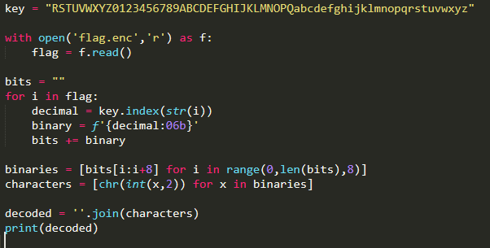

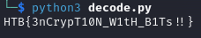