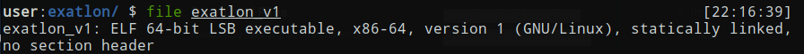
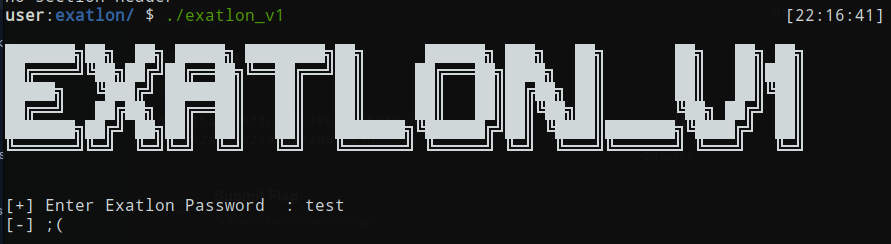
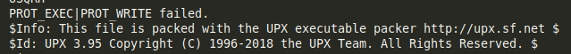
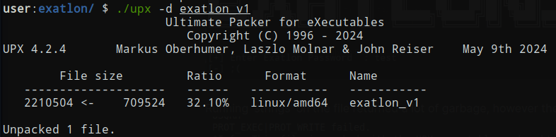
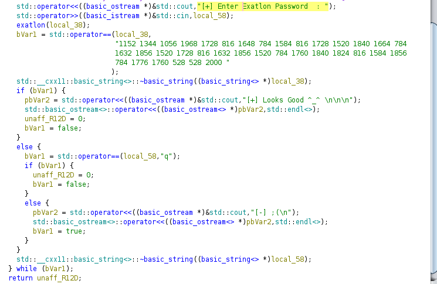
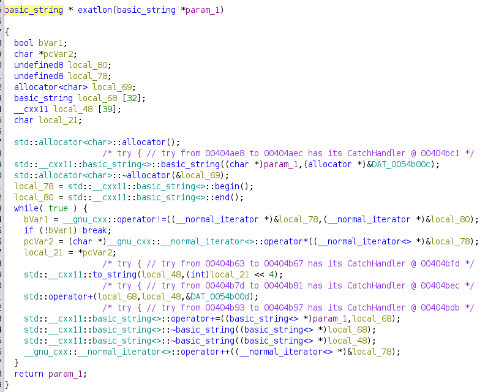
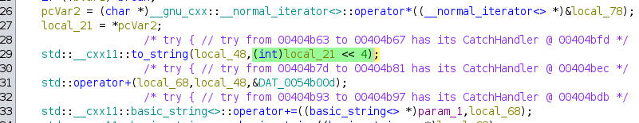
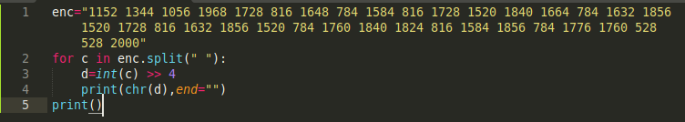
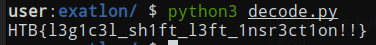

+++
title = 'HackTheBox Exatlon Challenge write-up'
date = 2024-11-20T07:07:07+01:00
+++
**CHALLENGE DESCRIPTION:**

*Can you find the password?*

The file provided is an elf file

The program asks for a password

Running 'strings' on the file returned a lot of garbage, however there was one interesting line

UPX, as shown in the screenshot, is a packer which is basically a compressor but packed programs can still run without the need of decompressing. However for analysis we have to unpack it

Now we can analyze it in ghidra

Of course we start with the main function. We find the string asking user for a password. Then we see that the output of the 'exatlon' function is compared to what seems to be some encoded string. We can also see that even if we provide correct password the only thing we get is a "Looks Good" message, no flag is returned. Let's look at the 'exatlon' function so hopefully we can decode the string, which seems to be the flag

It looks really ugly because of the C++ syntax. Still we can identify how the mystery string is encoded

This is the most important part of the function. It iterates through the string provided and it **left** shifts each character (converted to int) by 4, which essentially means that the value is multiplied by 16 (2^4). So now that we found a probable encoding let's test it on the string we found

This simple python code shifts **right** by 4 each number in the string and converts it back to ASCII

We got the flag