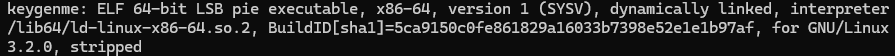
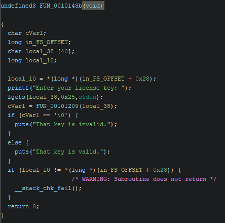
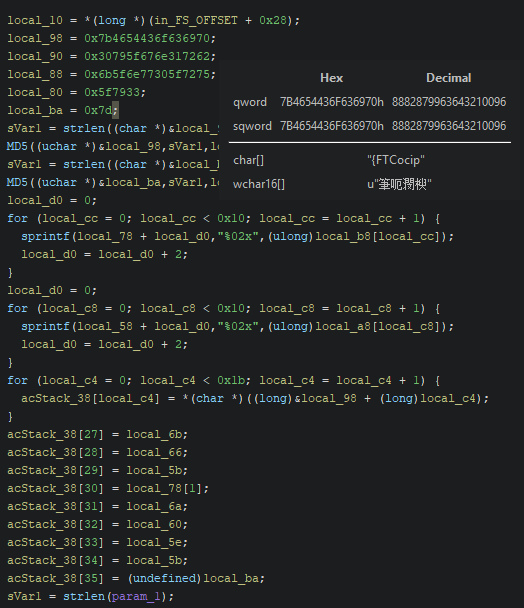
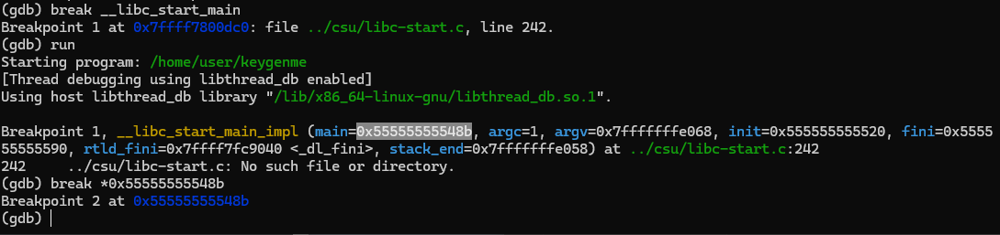
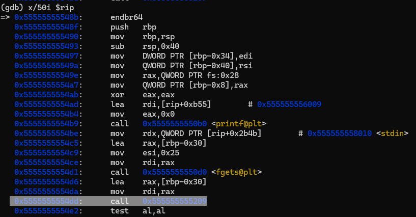
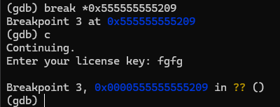
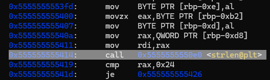
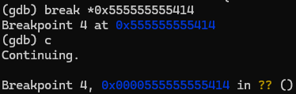
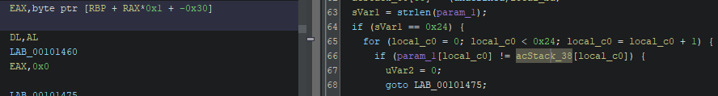
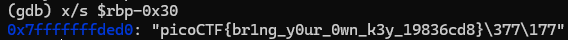

+++
title = 'PicoCTF keygenme write-up'
date = 2025-01-14T07:07:07+01:00
+++
**Description**

*Can you get the flag?
Reverse engineer this binary.*

We are provided with an elf file

Let's open it up in ghidra

After finding the main function we see that the program asks user for a key, then sends it to FUN_00101209 function. Based on the result of that function, program prints information whether the key is valid or not.  Let's take a look at FUN_00101209 function then. 

By looking at the hex data in the first few lines we can see that it's the flag - judging by the char representation "{FTCocip" (reversed because of the little endianness). We can simply read it. However it's not all of it. In the last for loop the flag is being written to the acStack_38 buffer. Then the last characters of the flag are being initialized dynamically so we are not able to see their values. Let's run the program in the debugger to find the value of the flag which should be completed before the last call of the strlen function.

Since setting a breakpoint on main didn't work, we can set it on __libc_main_start to find the address of the main function and set the breakpoint there. Next we can view the assembly intrustions to find the FUN_00101209 function call

Now that we've reached the funtion that initializes our flag, we have to find the strlen call that we saw in ghidra and find the flag stored in memory

Now we need to find out where the flag is stored in memory. Let's go back to ghidra and see the address of the acStack_38 buffer 

It's at rbp - 0x30 as seen in the disassembled instructions. Let's print the value at this location with string format

We found our flag