+++
title = 'HackTheBox - logjammer write-up'
date = 2024-10-16T07:07:07+01:00
+++

**Scenario:**

*You have been presented with the opportunity to work as a junior DFIR consultant for a big consultancy. However, they have provided a technical assessment for you to complete. The consultancy Forela-Security would like to gauge your Windows Event Log Analysis knowledge. We believe the Cyberjunkie user logged in to his computer and may have taken malicious actions. Please analyze the given event logs and report back.*

There is a zip file attached with windows event logs files. I uploaded them to splunk for easier analysis

**Questions:**

1. *When did the cyberjunkie user first successfully log into his computer? (UTC)*

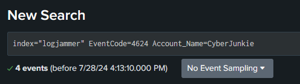

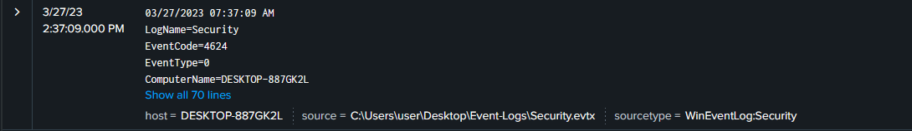

27/03/2023 14:37:09

2. *The user tampered with firewall settings on the system. Analyze the firewall event logs to find out the Name of the firewall rule added?*

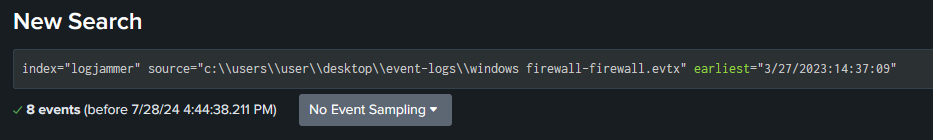

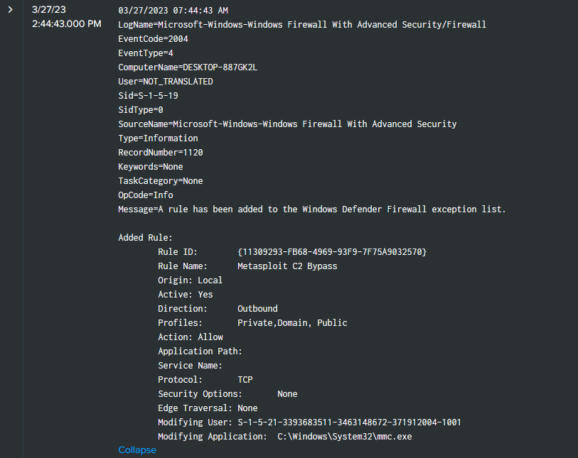

Metasploit C2 Bypass

3. *Whats the direction of the firewall rule?*

Outbound

4. *The user changed audit policy of the computer. Whats the Subcategory of this changed policy?*

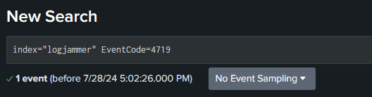

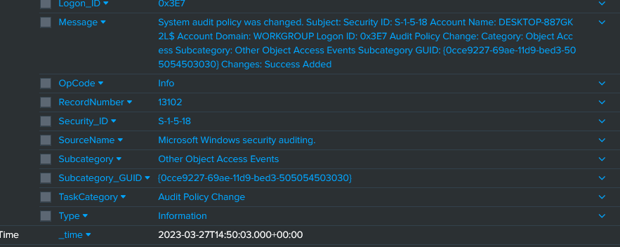

Other Object Access Events

5. *The user "cyberjunkie" created a scheduled task. Whats the name of this task?*

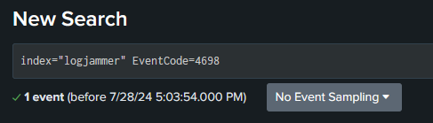

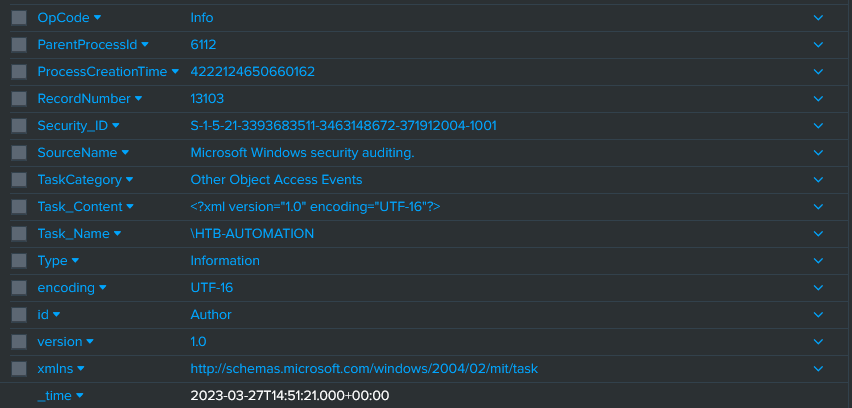

HTB-AUTOMATION

6. *Whats the full path of the file which was scheduled for the task?*

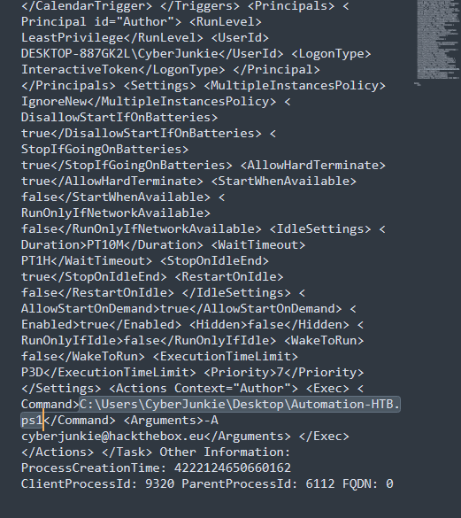

C:\Users\CyberJunkie\Desktop\Automation-HTB.ps1

7. *What are the arguments of the command?*

-A cyberjunkie@hackthebox.eu

8. *The antivirus running on the system identified a threat and performed actions on it. Which tool was identified as malware by antivirus?*

Useful event IDs for Microsoft Defender can be found here: https://learn.microsoft.com/en-us/defender-endpoint/troubleshoot-microsoft-defender-antivirus

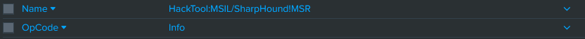

SharpHound

9. *Whats the full path of the malware which raised the alert?*

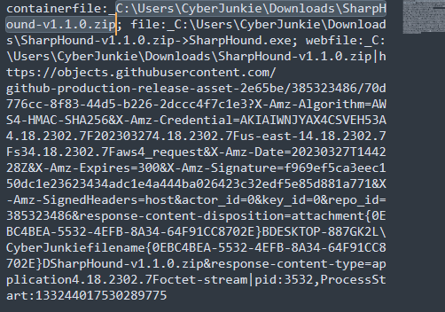

C:\Users\CyberJunkie\Downloads\SharpHound-v1.1.0.zip

10. *What action was taken by the antivirus?*

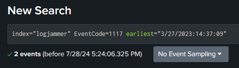

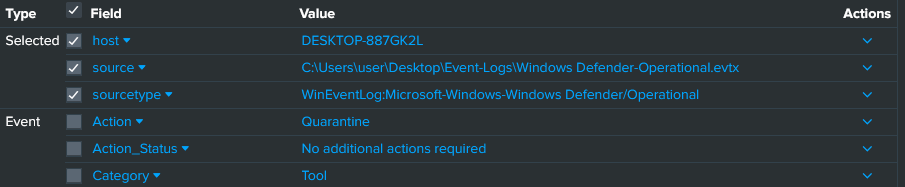

Quarantine

11. *The user used Powershell to execute commands. What command was executed by the user?*

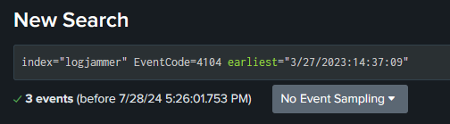

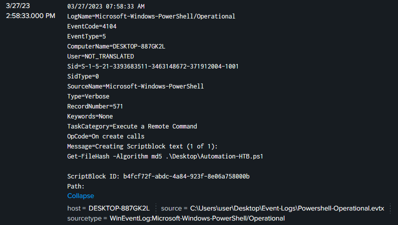

Get-FileHash -Algorithm md5 .\Desktop\Automation-HTB.ps1

12. *We suspect the user deleted some event logs. Which Event log file was cleared?*

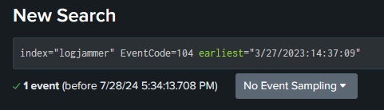

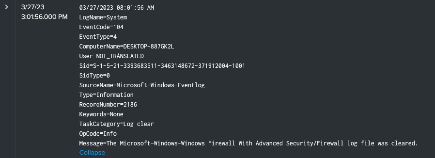

Microsoft-Windows-Windows Firewall With Advanced Security/Firewall